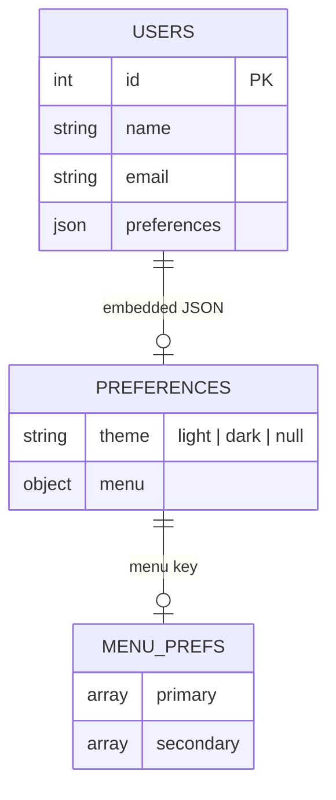

# feat: Implement Light/Dark Theme Toggle with Backend Persistence

## Overview

Add a light/dark theme preference to the WandaAsk dashboard. The preference is
persisted to the Laravel backend via `PUT /api/v1/users/me/preferences`, applied
globally across all dashboard pages via CSS variables on `<html>`, and
controlled from a new "Appearance" tab at `/dashboard/profile/appearance`. The
landing page is unaffected.

This is a **cross-repo feature** requiring coordinated backend and frontend
changes.

---

## Problem Statement

The dashboard is currently dark-only (one `:root` block in `globals.css`). There
is no mechanism for users to choose or persist a display theme. The backend
already stores user preferences as a JSON column (`preferences`) added on
2026-04-21, but does not yet validate or surface a `theme` field. The frontend
has no theme context, no light-mode CSS variables, and no toggle UI.

---

## Technical Approach

### Architecture Decision: SSR Theme Delivery

The theme must be applied **before React hydrates** to prevent a flash of the
wrong theme. Two viable options were evaluated:

| Option               | Mechanism                                                                                           | Trade-off                                                                 |
| -------------------- | --------------------------------------------------------------------------------------------------- | ------------------------------------------------------------------------- |
| **A — Cookie**       | Set `theme` cookie on save; read in root layout Server Component to inject `data-theme` on `<html>` | Zero extra latency; works across page loads; requires cookie management   |
| **B — Server fetch** | Fetch `/users/me` in `app/dashboard/layout.tsx` on every request                                    | Always accurate; adds one backend round-trip to every dashboard page load |

**Decision: Option A — Cookie.** Set a `theme` HTTP cookie
(`SameSite=Lax; Path=/`) when saving the preference. Read it in
`app/dashboard/layout.tsx` (a Server Component) to apply `data-theme="light"` or
`data-theme="dark"` directly on the wrapping `<div>` (or pass it as a prop to
the Providers tree via an initial value pattern). This is zero-latency for SSR
and does not add backend calls to the hot path.

Default when no cookie or preference: `"dark"` (matches current behaviour).

### Architecture Decision: Preferences Write Strategy (Critical)

The backend `UserPreferencesController` **replaces** the entire preferences JSON
on every write. There is no merge-on-write. If the theme save sends only
`{ theme: "light" }`, the `menu` preferences are silently wiped — and vice
versa.

**Decision: Frontend read-merge-write.** Every call to `updateUserPreferences()`
must:

1. Accept a `Partial<UserPreferences>` delta
2. Read the current preferences from the caller's in-memory context (not
   re-fetch from backend)
3. Merge delta into current preferences
4. PUT the merged object

This requires a `ThemeProvider` (or a top-level preferences context) to hold the
full `UserPreferences` object in memory, keeping all write paths (menu, theme,
future prefs) consistent.

> **Alternative considered:** Backend merge-on-write. Preferred long-term but
> requires a backend change that is out of scope for this sprint.

### CSS Variable Strategy

Tailwind v4 uses `@theme inline` in `globals.css` — all color utilities resolve
to `hsl(var(--<token>))`. The current `:root` block is dark-only. Light mode
will be implemented by adding a second selector block that redefines the same
CSS custom properties:

```css
/* existing dark default */
:root {
  --background: 240 40% 2%;
  --foreground: 220 20% 93%;
  /* ... */
}

/* light override */
html[data-theme='light'] {
  --background: 0 0% 98%;
  --foreground: 240 10% 10%;
  /* ... */
}
```

The `data-theme` attribute is set on `<html>` by the ThemeProvider (client-side)
and pre-applied by the dashboard layout (server-side via cookie).

### Hardcoded Inline Styles — Must Be Converted

`app/dashboard/layout.tsx` bypasses CSS variables with inline styles. These must
be converted:

| Location         | Current Value                   | Replacement                                      |
| ---------------- | ------------------------------- | ------------------------------------------------ |
| Root div `style` | `background: 'hsl(240 40% 2%)'` | Remove; use `bg-background` Tailwind class       |
| Sidebar `style`  | `rgba(8,8,22,0.75)`             | Convert to `bg-sidebar/75` or CSS var equivalent |
| Header `style`   | `rgba(8,8,22,0.7)`              | Convert to `bg-sidebar/70` or CSS var equivalent |

A pre-implementation audit of all `style={{ ... }}` props and hardcoded
`hsl()/rgb()` color strings across `app/dashboard/` is required (see Phase 0).

---

## Implementation Phases

### Phase 0 — Pre-Implementation Audit (Unblocked, Both Repos)

**Goal:** Identify all hardcoded colors and confirm backend contract before
writing any code.

Tasks:

- [ ] Grep `app/dashboard/` for `style=\{\{`, `hsl(`, `rgb(`,
      `#[0-9a-fA-F]{3,6}` — catalogue every hardcoded color that will not
      respond to CSS variable theming
- [ ] Confirm light-mode design token values with design (all CSS var values for
      `--background`, `--foreground`, `--card`, `--muted`, `--primary`,
      `--accent`, `--border`, `--sidebar`, etc.)
- [ ] Audit `shared/lib/chart-theme.ts` — `CHART_TOOLTIP_STYLE` uses
      `hsl(240 30% 7%)` hardcoded; decide whether charts must adapt to light
      mode in this sprint
- [ ] Confirm `<Toaster>` from Sonner needs a `theme` prop wired to active theme
- [ ] Read `UpdateUserPreferencesRequest.php` one more time to confirm adding
      `theme` to `getPreferences()` is safe (no side effects on existing menu
      flow)

**Files to audit:**

```
app/dashboard/layout.tsx          — 3 known inline styles
shared/lib/chart-theme.ts         — hardcoded dark chart colors
app/Providers.tsx                 — Toaster theme prop
```

---

### Phase 1 — Backend: Extend Preferences Validation

**Scope:** `/Users/slavapopov/Documents/WandaAsk_backend`  
**Branch:** `feat/theme-preference` from `dev`

#### 1.1 — Extend `UpdateUserPreferencesRequest`

**File:** `app/Http/Requests/API/v1/UpdateUserPreferencesRequest.php`

Add `theme` validation rule:

```php
// In rules():
'theme' => ['nullable', 'string', Rule::in(['light', 'dark'])],

// In getPreferences():
return $this->only(['menu', 'theme']);
```

This ensures:

- Unknown values (`'sepia'`, `'system'`) are rejected with 422
- `null` is accepted (means "unset, use default")
- Existing `menu` validation is unchanged

#### 1.2 — Verify `GET /api/v1/users/me` Returns `preferences.theme`

The inline closure in `routes/api.php` returns
`array_merge($user->toArray(), ['preferences' => $user->preferences])`. Since
`preferences` is cast as `array`, the `theme` key will appear once it is stored.
**No code change needed** — verify by writing a test or checking with a manual
request after the frontend saves a theme.

#### 1.3 — (Optional) Add `ThemePreference` Enum

```php
// app/Enums/ThemePreference.php
enum ThemePreference: string {
    case Light = 'light';
    case Dark  = 'dark';
}
```

Use in the validation rule: `Rule::enum(ThemePreference::class)`. This makes the
constraint explicit and reusable. Mark as optional if time-constrained.

**Acceptance Criteria — Phase 1:**

- [ ] `PUT /api/v1/users/me/preferences` with `{ "theme": "light" }` returns 200
      and stores the value
- [ ] `PUT /api/v1/users/me/preferences` with `{ "theme": "sepia" }` returns 422
- [ ] Sending `{ "menu": {...} }` without `theme` does not wipe an existing
      stored theme
- [ ] `GET /api/v1/users/me` response includes `preferences.theme` once stored
- [ ] Existing menu preferences save/load flow is unaffected

---

### Phase 2 — Frontend: Types and Preferences Context

**Scope:** `/Users/slavapopov/Documents/WandaAsk_frontend`  
**Branch:** `feat/add-theme-toggle` (current branch)

#### 2.1 — Extend `UserPreferences` Type

**File:** `entities/user/model/types.ts`

```ts
export type Theme = 'light' | 'dark';

export interface UserPreferences {
  menu?: UserMenuPreferences;
  theme?: Theme;
}
```

#### 2.2 — Create `ThemeProvider`

**File:** `app/providers/ThemeProvider.tsx`

```tsx
'use client';

import { createContext, useContext, useEffect, useMemo, useState } from 'react';
import type { Theme } from '@/entities/user/model/types';

interface ThemeContextValue {
  theme: Theme;
  setTheme: (theme: Theme) => void;
}

const ThemeContext = createContext<ThemeContextValue | null>(null);

const THEME_COOKIE = 'wanda-theme';
const DEFAULT_THEME: Theme = 'dark';

function setCookie(value: Theme) {
  document.cookie = `${THEME_COOKIE}=${value};path=/;SameSite=Lax;max-age=31536000`;
}

export function ThemeProvider({
  children,
  initialTheme,
}: {
  children: React.ReactNode;
  initialTheme?: Theme;
}) {
  const [theme, setThemeState] = useState<Theme>(initialTheme ?? DEFAULT_THEME);

  useEffect(() => {
    document.documentElement.dataset.theme = theme;
  }, [theme]);

  const setTheme = (next: Theme) => {
    setThemeState(next);
    setCookie(next);
    document.documentElement.dataset.theme = next;
  };

  const value = useMemo(() => ({ theme, setTheme }), [theme]);

  return (
    <ThemeContext.Provider value={value}>{children}</ThemeContext.Provider>
  );
}

export function useTheme(): ThemeContextValue {
  const ctx = useContext(ThemeContext);
  if (!ctx) throw new Error('useTheme must be used inside ThemeProvider');
  return ctx;
}
```

**Key design notes:**

- `initialTheme` is read from a cookie on the server and passed as a prop — no
  `useEffect` needed for the initial DOM attribute, it's already correct from
  SSR
- `setTheme` updates state, writes a cookie (for next SSR), and updates
  `document.documentElement.dataset.theme` synchronously for instant feedback
- No `localStorage` — cookie is the source of truth for SSR hydration

#### 2.3 — Integrate `ThemeProvider` into Dashboard Layout

**File:** `app/dashboard/layout.tsx`

Read the theme cookie server-side and pass as `initialTheme`:

```tsx
import { cookies } from 'next/headers';
import { ThemeProvider } from '@/app/providers/ThemeProvider';
import type { Theme } from '@/entities/user/model/types';

export default async function DashboardLayout({
  children,
}: {
  children: React.ReactNode;
}) {
  const cookieStore = await cookies();
  const theme = (cookieStore.get('wanda-theme')?.value ?? 'dark') as Theme;

  return (
    <ThemeProvider initialTheme={theme}>
      <div
        className='flex h-screen overflow-hidden bg-background'
        // Remove the hardcoded style={{ background: '...' }}
      >
        {/* ... rest of layout unchanged ... */}
      </div>
    </ThemeProvider>
  );
}
```

Convert the three inline styles identified in Phase 0 to Tailwind/CSS-var
classes.

**Note:** `ThemeProvider` wraps the dashboard layout, NOT `app/Providers.tsx`
(which wraps the entire app including the landing page). This correctly scopes
the theme to dashboard routes only.

#### 2.4 — Add Light-Mode CSS Variables

**File:** `app/globals.css`

Add after the `:root` dark block (exact HSL values to be confirmed with design —
these are illustrative):

```css
html[data-theme='light'] {
  --background: 0 0% 98%;
  --foreground: 240 10% 10%;
  --card: 0 0% 100%;
  --card-foreground: 240 10% 10%;
  --popover: 0 0% 100%;
  --popover-foreground: 240 10% 10%;
  --primary: 263 79% 55%;
  --primary-foreground: 0 0% 100%;
  --secondary: 240 5% 90%;
  --secondary-foreground: 240 10% 10%;
  --muted: 240 5% 94%;
  --muted-foreground: 240 5% 45%;
  --accent: 142 76% 36%;
  --accent-foreground: 0 0% 100%;
  --destructive: 0 72% 51%;
  --destructive-foreground: 0 0% 100%;
  --border: 240 5% 84%;
  --input: 240 5% 84%;
  --ring: 263 79% 55%;
  --sidebar: 240 5% 96%;
  --sidebar-foreground: 240 10% 10%;
}
```

**Acceptance Criteria — Phase 2:**

- [ ] `UserPreferences` type includes `theme?: 'light' | 'dark'`
- [ ] `ThemeProvider` mounts without SSR hydration mismatch
- [ ] `data-theme` attribute on `<html>` matches `initialTheme` on first paint
      (no flash)
- [ ] Dashboard background responds to `data-theme` change
- [ ] Landing page unaffected (no `ThemeProvider` outside dashboard layout)

---

### Phase 3 — Frontend: Server Action Extension

**File:** `features/user-profile/api/preferences.ts`

Extend `updateUserPreferences()` to accept a `Partial<UserPreferences>` delta
and merge it with the caller-provided current preferences:

```ts
'use server';

import { httpClient } from '@/shared/lib/httpClient';
import { revalidatePath } from 'next/cache';
import { cookies } from 'next/headers';
import type { ActionResult } from '@/shared/types/server-action';
import type { UserPreferences, Theme } from '@/entities/user/model/types';

const API_URL = process.env.NEXT_PUBLIC_API_URL;

export async function updateUserPreferences(
  current: UserPreferences,
  delta: Partial<UserPreferences>,
): Promise<ActionResult> {
  const merged: UserPreferences = { ...current, ...delta };
  try {
    await httpClient<void>(`${API_URL}/users/me/preferences`, {
      method: 'PUT',
      headers: { 'Content-Type': 'application/json' },
      body: JSON.stringify(merged),
    });
    revalidatePath('/dashboard', 'layout');
    return { data: undefined, error: null };
  } catch {
    return { data: null, error: 'Failed to save preferences' };
  }
}

export async function updateThemePreference(
  current: UserPreferences,
  theme: Theme,
): Promise<ActionResult> {
  const cookieStore = await cookies();
  cookieStore.set('wanda-theme', theme, {
    path: '/',
    sameSite: 'lax',
    maxAge: 31536000,
  });
  return updateUserPreferences(current, { theme });
}
```

**Note on existing menu save:** The menu customization form in
`features/user-profile/ui/MenuSettingsForm.tsx` calls `updateUserPreferences()`.
Its signature must be updated to pass the current full preferences (including
`theme`) as the first argument. This prevents menu saves from wiping the stored
theme.

**Acceptance Criteria — Phase 3:**

- [ ] `updateThemePreference(current, 'light')` writes cookie and PUTs merged
      payload
- [ ] The existing menu save does not wipe the theme field
- [ ] `revalidatePath('/dashboard', 'layout')` fires after successful save

---

### Phase 4 — Frontend: Appearance Tab and Toggle Component

#### 4.1 — Add Route Constant

**File:** `shared/lib/routes.ts`

```ts
PROFILE_APPEARANCE: '/dashboard/profile/appearance',
```

#### 4.2 — Extend Profile Tab Navigation

**File:** `features/user-profile/ui/profile-tabs-nav.tsx`

Add the Appearance tab last in the `TABS` array:

```ts
{ href: ROUTES.DASHBOARD.PROFILE_APPEARANCE, label: 'Appearance' }
```

#### 4.3 — Create Appearance Page

**File:** `app/dashboard/profile/appearance/page.tsx`

```tsx
import { getUser } from '@/features/user-profile/api/profile';
import { AppearanceSection } from '@/features/user-profile/ui/AppearanceSection';

export default async function AppearancePage() {
  const user = await getUser(); // reads preferences.theme from GET /users/me
  return <AppearanceSection currentPreferences={user.preferences ?? {}} />;
}
```

**File:** `app/dashboard/profile/appearance/loading.tsx`

```tsx
import { Skeleton } from '@/shared/ui/layout/skeleton';
export default function Loading() {
  return <Skeleton className='h-48 w-full' />;
}
```

#### 4.4 — Create `AppearanceSection` Component

**File:** `features/user-profile/ui/AppearanceSection.tsx`

```tsx
'use client';

import { useState, useTransition } from 'react';
import { toast } from 'sonner';
import { useTheme } from '@/app/providers/ThemeProvider';
import { updateThemePreference } from '@/features/user-profile/api/preferences';
import type { UserPreferences, Theme } from '@/entities/user/model/types';

interface Props {
  currentPreferences: UserPreferences;
}

const THEMES: { value: Theme; label: string; description: string }[] = [
  { value: 'dark', label: 'Dark', description: 'Cosmic dark theme (default)' },
  {
    value: 'light',
    label: 'Light',
    description: 'Light theme for bright environments',
  },
];

export function AppearanceSection({ currentPreferences }: Props) {
  const { theme, setTheme } = useTheme();
  const [isPending, startTransition] = useTransition();

  const handleThemeChange = (next: Theme) => {
    const previous = theme;
    setTheme(next); // optimistic — instant visual feedback

    startTransition(async () => {
      const result = await updateThemePreference(currentPreferences, next);
      if (result.error) {
        setTheme(previous); // revert on failure
        toast.error('Failed to save theme preference');
      }
    });
  };

  return (
    <section aria-labelledby='appearance-heading' className='space-y-6'>
      <div>
        <h2 id='appearance-heading' className='text-lg font-semibold'>
          Appearance
        </h2>
        <p className='text-sm text-muted-foreground mt-1'>
          Choose your preferred display theme.
        </p>
      </div>

      <div
        role='radiogroup'
        aria-label='Theme selection'
        className='grid grid-cols-2 gap-3'
      >
        {THEMES.map(({ value, label, description }) => (
          <label
            key={value}
            className={`
              flex flex-col gap-1 rounded-lg border p-4 cursor-pointer
              transition-colors select-none
              ${theme === value ? 'border-primary bg-primary/5' : 'border-border hover:border-primary/50'}
              ${isPending ? 'opacity-60 pointer-events-none' : ''}
            `}
          >
            <input
              type='radio'
              name='theme'
              value={value}
              checked={theme === value}
              onChange={() => handleThemeChange(value)}
              className='sr-only'
              aria-label={label}
            />
            <span className='font-medium'>{label}</span>
            <span className='text-xs text-muted-foreground'>{description}</span>
          </label>
        ))}
      </div>
    </section>
  );
}
```

**Design notes:**

- Radio group pattern — accessible, keyboard navigable, supports future 3rd
  option (`'system'`)
- Optimistic update with revert-on-failure
- `useTransition` prevents the UI from freezing during async save
- No debounce needed — radio buttons can only be clicked once per value (not
  rapidly toggled)

#### 4.5 — Export from Feature Index

**File:** `features/user-profile/index.ts`

Add: `export { AppearanceSection } from './ui/AppearanceSection';`

#### 4.6 — Wire Sonner Toaster Theme

**File:** `app/Providers.tsx` — Sonner's `<Toaster>` is currently
theme-agnostic. Since `Providers.tsx` wraps the full app (including landing
page) and `ThemeProvider` only wraps dashboard, the simplest approach is to read
the cookie in `app/layout.tsx` and pass the Toaster a `theme` prop, or accept
that Sonner auto-detects the system preference (default behavior). **Decision:
defer to Phase 4 post-review** — Sonner `richColors` mode auto-adapts
reasonably.

**Acceptance Criteria — Phase 4:**

- [ ] `/dashboard/profile/appearance` renders the Appearance tab
- [ ] Tab strip on profile shows 5 tabs: Account Info, Password, Calendar, Menu,
      Appearance
- [ ] Selecting "Light" theme: `data-theme="light"` appears on `<html>`
      immediately
- [ ] Selecting "Dark" theme: `data-theme="dark"` appears on `<html>`
      immediately
- [ ] Preference is saved to backend (verify via `GET /users/me` in devtools)
- [ ] On page reload, the saved theme is applied before React hydrates (no
      flash)
- [ ] On failure, theme reverts and toast.error fires
- [ ] Component is keyboard-navigable (Tab to reach radio, arrow keys to change)
- [ ] `loading.tsx` renders the skeleton while the page loads

---

### Phase 5 — Verification and Polish

#### 5.1 — Audit Existing Preference Save Flows

Update `MenuSettingsForm.tsx` to pass current preferences (including `theme`)
when calling `updateUserPreferences()`:

```tsx
// Before: updateUserPreferences({ menu: payload })
// After:  updateUserPreferences(currentPreferences, { menu: payload })
```

The component must receive `currentPreferences` as a prop (passed from the
server page).

#### 5.2 — FSD Boundary Check

Run `fsd-boundary-guard` agent to confirm:

- `AppearanceSection` does not import across feature boundaries
- `useTheme` hook lives in `app/providers/` (not `features/` or `shared/`) —
  acceptable since ThemeProvider is dashboard-layout-scoped
- No circular imports introduced

#### 5.3 — Design Review

Run `design-guardian` agent on:

- `AppearanceSection` component — verify it fits cosmic dark design system
- Light-mode CSS variables — verify contrast ratios and visual consistency

#### 5.4 — Pre-Commit Review

Run `mr-reviewer` agent before pushing. Confirm:

- `'use server'` at top of all `api/*.ts` files
- No `any` types introduced
- All new routes added to `ROUTES.DASHBOARD`
- `loading.tsx` exists for new route
- Existing `updateUserPreferences()` callers updated

---

## File Map

### Backend (new/modified)

```
app/Http/Requests/API/v1/UpdateUserPreferencesRequest.php  — add theme validation + getPreferences()
app/Enums/ThemePreference.php                              — (optional) new enum
```

### Frontend (new/modified)

```
entities/user/model/types.ts                               — add Theme type, extend UserPreferences
app/providers/ThemeProvider.tsx                            — new ThemeProvider + useTheme hook
app/dashboard/layout.tsx                                   — read cookie, wrap with ThemeProvider, remove inline styles
app/globals.css                                            — add html[data-theme="light"] block
shared/lib/routes.ts                                       — add PROFILE_APPEARANCE
features/user-profile/
  api/preferences.ts                                       — extend updateUserPreferences, add updateThemePreference
  ui/profile-tabs-nav.tsx                                  — add Appearance tab
  ui/AppearanceSection.tsx                                 — new component
  ui/MenuSettingsForm.tsx                                  — update call signature to pass current preferences
  index.ts                                                 — export AppearanceSection
app/dashboard/profile/appearance/
  page.tsx                                                 — new page
  loading.tsx                                              — new skeleton loader
```

---

## ERD — Preferences Structure

```
users
  id        int PK
  name      string
  email     string
  preferences  json (nullable)
    ├── menu
    │   ├── primary   [{ id: string, visible: bool }]
    │   └── secondary [{ id: string, visible: bool }]
    └── theme         'light' | 'dark' | null
```



---

## Acceptance Criteria

### Functional

- [ ] `/dashboard/profile/appearance` page exists with a theme selector
- [ ] Selecting a theme applies it instantly across the entire dashboard
- [ ] Theme persists across browser sessions (cookie + backend)
- [ ] Reloading any dashboard page reflects the saved theme with no flash
- [ ] The landing page is unaffected by theme changes
- [ ] Menu preference saves do not wipe the theme, and vice versa

### Non-Functional

- [ ] Theme toggle is keyboard navigable and screen-reader friendly (radio group
      with labels)
- [ ] No TypeScript errors (`strict: true` passes)
- [ ] No ESLint violations
- [ ] Light theme CSS variables pass WCAG AA contrast ratios
- [ ] No hydration warnings in browser console

### Quality Gates

- [ ] `fsd-boundary-guard` passes with no violations
- [ ] `mr-reviewer` passes with no blocking issues
- [ ] `design-guardian` approves both AppearanceSection component and light-mode
      palette
- [ ] `backend-contract-validator` confirms TypeScript types match backend
      Resource/DTO

---

## Open Questions (Resolve Before Coding Phase 4)

| #   | Question                                                                                  | Default If Unresolved                                        |
| --- | ----------------------------------------------------------------------------------------- | ------------------------------------------------------------ |
| 1   | What are the exact light-mode HSL values for all CSS variables?                           | **Blocks Phase 4 CSS** — cannot proceed without design input |
| 2   | Should chart components (`shared/lib/chart-theme.ts`) adapt to light mode in this sprint? | Defer to follow-up sprint                                    |
| 3   | Should the Toaster theme prop be wired to active theme?                                   | Defer — Sonner auto-detects reasonably                       |
| 4   | Should `prefers-color-scheme` be honored as the default when no preference is saved?      | No — default to dark                                         |
| 5   | Where does "Appearance" appear in the profile tab strip order?                            | Last (after "Menu")                                          |
| 6   | Should a quick-access theme toggle appear in the top navigation bar?                      | No — profile appearance tab only for now                     |

---

## Dependencies and Risks

| Risk                                                  | Likelihood | Impact                    | Mitigation                                                                                                                                |
| ----------------------------------------------------- | ---------- | ------------------------- | ----------------------------------------------------------------------------------------------------------------------------------------- |
| Light-mode design tokens not ready                    | High       | Blocks CSS phase          | Commission from design before Phase 4; stub with placeholder values in dev                                                                |
| Backend team delay on extending FormRequest           | Medium     | Delays testing            | Frontend can mock with a feature flag; send theme in payload even before backend validates (will be silently ignored until backend ships) |
| Hardcoded color audit reveals many more inline styles | Medium     | Scope creep               | Strictly scope Phase 0 audit; defer non-layout component color fixes to follow-up                                                         |
| Preferences merge race condition (two tabs)           | Low        | Data corruption           | Document known limitation; defer proper CRDT/merge strategy to backend                                                                    |
| SSR hydration mismatch if cookie not set              | Low        | Flash on first visit only | Acceptable — dark is the default and the current behavior                                                                                 |

---

## References

### Internal

- Dashboard layout: `app/dashboard/layout.tsx`
- Existing preferences API: `features/user-profile/api/preferences.ts`
- CSS variables: `app/globals.css` `:root` block
- UserPreferences type: `entities/user/model/types.ts`
- Profile tab nav: `features/user-profile/ui/profile-tabs-nav.tsx`
- Backend FormRequest:
  `/Users/slavapopov/Documents/WandaAsk_backend/app/Http/Requests/API/v1/UpdateUserPreferencesRequest.php`
- Backend preferences controller:
  `/Users/slavapopov/Documents/WandaAsk_backend/app/Http/Controllers/API/v1/UserPreferencesController.php`
- ROUTES constants: `shared/lib/routes.ts`
- httpClient pattern: `shared/lib/httpClient.ts`

### Patterns to Follow

- Preferences server action: `features/user-profile/api/preferences.ts`
  (`updateUserPreferences`)
- Tab navigation convention: `features/user-profile/ui/profile-tabs-nav.tsx` +
  `CLAUDE.md §Tab Navigation Convention`
- Context provider pattern: `shared/ui/modal/modal-context.tsx`
- ActionResult pattern: `shared/types/server-action.ts`
