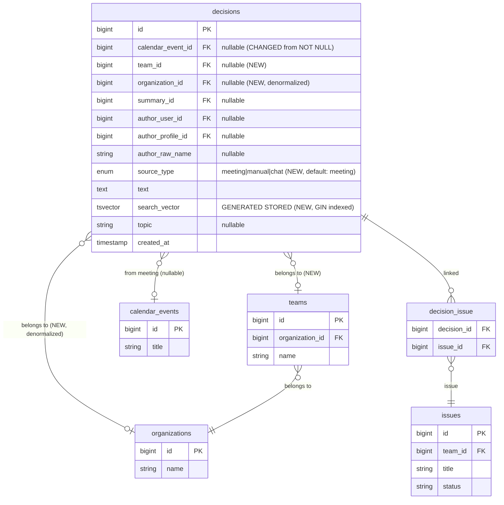

# Team Discussion Log & Knowledge Base

## Enhancement Summary

**Deepened on:** 2026-04-28 **Research agents used:** security-sentinel,
architecture-strategist, data-migration-expert, performance-oracle,
agent-native-reviewer, product-lens, kieran-typescript-reviewer,
feasibility+coherence reviewer, best-practices-researcher, scope-guardian

### Key Improvements Added

1. **Critical security gap closed** — `SaveTeamDecisionTool` needs team
   membership check before any write; IDOR via sequential `team_id` integers is
   confirmed exploitable via existing `GetTeamMembersTool` pattern
2. **Blocker found: `calendar_events.team_id` does not exist** — the backfill
   JOIN in the migration plan is invalid; must verify/add `team_id` to
   `calendar_events` first
3. **Architecture correction** — extending `decisions` table breaks existing
   meeting-extraction invariants; recommend new `team_decisions` table or at
   minimum update `ExtractDecisionsService` to write `team_id`
4. **Database is PostgreSQL, not MySQL** — replace `LIKE '%keyword%'` + FULLTEXT
   plan with PostgreSQL GIN `tsvector` index
5. **3 critical agent-native gaps found** — missing `source_type` param in tool,
   `team_id` never injected into agent context, `decision_log` not added to
   `ArtifactSchema::dataDescription()`
6. **TypeScript discriminated union required** — `DecisionEntry` must be a union
   per source_type, not a flat optional struct
7. **6 scope cuts recommended** — workspace mirror, tags, heat-map, conflict
   detection, voting, and export all cut from MVP

### New Considerations Discovered

- `calendar_events` has no `team_id` column — backfill plan is broken
- `ExtractDecisionsService` does not write `team_id` on new rows — must be fixed
  alongside migration
- Stored prompt injection via decision text into future LLM sessions is a real
  attack vector
- `/decision` chat command requires a backend `AgentService.php` change, not a
  frontend change
- Phase 4 (system prompt update) should be a separate PR due to cross-cutting
  blast radius
- `DISCUSS_LOG_SEARCH` route constant will be dead code — either wire or remove
- Feature module should be named `features/decisions/` (matches backend noun),
  not `features/discuss-log/`

---

## Overview

Add a team-scoped **Discussion Log** — a living knowledge base of architectural
decisions, technology choices, and team agreements. The LLM (Wanda) can query
this base when a user asks retrospective questions ("why did we choose X?", "how
did we decide Y?", "show history of Z"), providing dated, attributed answers
with full context.

The feature lives in two places:

1. **`/dashboard/decisions`** — a dedicated page showing the full log, with
   search and filter
2. **In the chat** — the LLM tool `search_team_decisions` pulls relevant entries
   and answers naturally; Wanda cites decisions inline with links

> **Product Priority Note (from product-lens review):** The LLM chat query
> capability is the core value, not the browse page. Build the Wanda citation
> card and rich `decision_log` artifact first. The browse page is secondary
> scaffolding. The feature competes with Notion/Confluence — the differentiator
> is that Wanda can answer "why?" from chat without the user leaving.

---

## Problem Statement / Motivation

Teams accumulate critical decisions over months — tech stack choices, process
agreements, priority calls — but they're scattered across meeting summaries,
Telegram threads, and people's memories. When someone asks "why are we using
microservices?", there's no single place to look. This feature creates that
institutional memory: a structured, searchable, LLM-accessible record of team
decisions.

The backend already has a `decisions` table (from meeting extraction) and
`AgentMemory` infrastructure. The gaps are:

- No team-scoped decision browsing UI
- No manual "write a decision" flow
- No MCP tool the LLM can call to look up team decisions by keyword/date/topic
- No artifact type to render a decision summary in chat

---

## Key Design Decisions & Alternatives Considered

### Storage: Where do Team Decisions Live?

Three options evaluated:

#### Option A: Extend the existing `decisions` table ⚠️ PARTIALLY RECOMMENDED (with caveats)

**Architecture-strategist finding:** The existing `decisions` table has
`calendar_event_id NOT NULL` — every row is constrained to a meeting.
`ExtractDecisionsService`, `DecisionAuthorResolver`, and
`DecisionFollowupNotifier` all rely on this invariant. Breaking it by adding
`source_type='manual'` rows without a `calendar_event_id` will require defensive
`source_type` checks throughout the downstream pipeline.

**Recommended hybrid approach:**

- **Option A is acceptable** if `calendar_event_id` is made nullable in the same
  migration (safe additive change) AND `ExtractDecisionsService::extract()` is
  updated to write `team_id` at creation time
- The `source_type` default `'meeting'` correctly covers all existing rows
- Add `organization_id` as a denormalized column to avoid 3-hop JOINs for team
  scoping

**Critical blocker (data-migration-expert finding):** `calendar_events` table
does NOT have a `team_id` column. The backfill JOIN
`UPDATE decisions d JOIN calendar_events ce ON ... SET d.team_id = ce.team_id`
is **invalid** — it will error or silently set NULL. Before writing any
migration, verify the actual team derivation path for calendar events.

#### Option B: New `team_decisions` table (architecture-strategist recommendation)

- Clean separation, no invariant breakage
- New table: `id`, `team_id`, `organization_id`, `source_type`, `text`, `topic`,
  `author_user_id`, `author_raw_name`, `calendar_event_id` (nullable FK to
  `decisions.id` for meeting-sourced entries), `created_at`
- Pros: zero coupling to meeting extraction pipeline
- Cons: two models for "decision" concept

**Decision: Use Option A (extend `decisions` table) but with these mandatory
changes:**

1. Make `calendar_event_id` nullable in the same migration
2. Add `organization_id` (denormalized) to avoid multi-hop JOINs
3. Update `ExtractDecisionsService` to populate `team_id` + `organization_id` at
   creation
4. Verify team derivation path before writing the backfill

#### Option C: Use `Workspace` filesystem — REJECTED (scope guardian cut)

No current consumer, speculative infrastructure. Removed from MVP scope.

---

### LLM Access: Tool vs Context Injection

#### Option A: New MCP tool `search_team_decisions` ✅ RECOMMENDED

**Architecture-strategist finding:** The naming `search_` (not `get_`) is more
accurate because results are keyword/topic filtered, not a fixed bounded set.
All search-intent tools in `HrServer.php` use the `search_` verb (e.g.
`search_meetings`).

- LLM calls
  `search_team_decisions(team_id?, keyword?, topic?, source_type?, date_from?, date_to?, limit?)`
- Triggered by retrospective keywords: "почему", "как мы решили", "история",
  "/history"
- Returns structured array:
  `[{id, date, topic, text, author, source_type, linked_issues[]}]`
- Enforce `limit = min($limit ?? 10, 20)` — never allow unbounded LLM fetches

**Agent-native finding:** `team_id` must come from
`AgentRunOptions::systemPromptExtension` injected by `ChannelRuntimeService`,
not from the LLM guessing. Without injection, multi-team users get wrong-team
results silently.

#### Option B: System prompt injection — REJECTED

Token bloat, stale data, not scalable.

---

### Write Policy: Who Can Create Manual Decisions?

- **L1 — Meeting auto-extraction** (already works via `ExtractDecisionsService`)
  — must be updated to write `team_id`
- **L2 — Chat `/decision` command** — requires `AgentService.php`
  `getSystemPrompt()` change (backend PHP, not frontend) — **Phase 4, separate
  PR**
- **L3 — Manual form** — dedicated "Add Decision" form on `/dashboard/decisions`
  page — MVP

**Scope guardian cut:** Phase 4 (system prompt + chat integration) should be a
**separate PR** due to cross-cutting blast radius. The system prompt change
affects every chat session.

---

### UX: Tab Structure Correction

**Product-lens finding:** Filtering by `source_type` (Meetings / Manual / Chat)
is an engineering concern, not a user concern. Better axes:

- **Recent / All / Archived** — natural temporal flow
- Or: **Search-first flat list** — for teams with <100 decisions, a search bar +
  date-sorted list is simpler

**Decision:** Replace source-type tabs with **All / Meetings / Manual** tabs
(keep for now — engineers and managers often do want to review what was
auto-extracted vs. manually entered). But acknowledge this may change based on
user feedback. Add a proper search bar that's always visible.

---

## Architecture & Data Flow

```
┌─────────────────────────────────────────────────────────────────┐
│                       DATA SOURCES                               │
│  Meeting summary (auto) ──► ExtractDecisionsService              │
│                             (UPDATED: also writes team_id)       │
│  Chat /decision command ──► AgentService system prompt           │
│                             → SaveTeamDecisionTool               │
│  Manual form ──────────────► POST /api/v1/teams/{team}/decisions │
└───────────────────────────────┬─────────────────────────────────┘
                                │
                      decisions table
                      (+ team_id, organization_id, source_type)
                      (calendar_event_id made nullable)
                                │
              ┌─────────────────┼──────────────────────┐
              │                 │                      │
GET /teams/{team}/decisions   MCP Tool              GIN tsvector
(REST, cursor paginated)   search_team_decisions    index on text
              │                 │
    Frontend page          LLM Chat response
    /dashboard/decisions   with decision_log artifact
                           + inline citation card
```

---

## Implementation Phases

### Phase 1: Backend Foundation

**Goal:** Extend `decisions` table safely, add REST API, update extraction
pipeline.

#### 1a. Pre-migration Verification (CRITICAL — do this first)

Before writing the migration, verify the team derivation path for calendar
events:

```bash
# Check calendar_events table columns
php artisan db:show --table=calendar_events
# OR
\d calendar_events  # in psql
```

If `calendar_events` has no `team_id`, determine the actual team FK path and
adjust the backfill SQL accordingly.

#### 1b. Database Migration (backend)

```php
// new migration: 2026_04_28_add_team_scope_to_decisions.php
Schema::table('decisions', function (Blueprint $table) {
    // Make calendar_event_id nullable to allow manual/chat decisions
    $table->unsignedBigInteger('calendar_event_id')->nullable()->change();

    // Add team and org scoping (denormalized for query efficiency)
    $table->unsignedBigInteger('team_id')->nullable()->after('calendar_event_id');
    $table->unsignedBigInteger('organization_id')->nullable()->after('team_id');

    // Source tracking — use DB enum for consistency with codebase pattern
    $table->enum('source_type', ['meeting', 'manual', 'chat'])
          ->default('meeting')
          ->after('organization_id');

    $table->foreign('team_id')->references('id')->on('teams')->nullOnDelete();
    $table->foreign('organization_id')->references('id')->on('organizations')->nullOnDelete();

    // Primary filter index — team + time (correct leading column for = then ORDER BY)
    $table->index(['team_id', 'created_at']);
    $table->index(['organization_id', 'created_at']);
});

// Backfill source_type (default handles existing rows)
// Backfill team_id: only after verifying calendar_events.team_id exists
// DB::statement("UPDATE decisions d JOIN calendar_events ce ON ce.id = d.calendar_event_id SET d.team_id = ce.team_id WHERE d.team_id IS NULL");

// Add PostgreSQL GIN full-text search index (NOT MySQL FULLTEXT — db is PostgreSQL)
DB::statement("
    ALTER TABLE decisions
    ADD COLUMN IF NOT EXISTS search_vector tsvector
    GENERATED ALWAYS AS (
        to_tsvector('russian', coalesce(text,'') || ' ' || coalesce(topic,''))
    ) STORED
");
DB::statement("CREATE INDEX IF NOT EXISTS decisions_search_vector_gin ON decisions USING GIN (search_vector)");
```

> **Performance insight (performance-oracle):** The DB is PostgreSQL (confirmed
> via `.env.example`). Use GIN `tsvector` index, not MySQL FULLTEXT. At 100k
> rows, `LIKE '%keyword%'` takes ~80ms; GIN `@@` query takes <1ms. Add this
> index now — adding later requires a full table rewrite.

#### 1c. Update `ExtractDecisionsService` (backend) — MANDATORY

```php
// app/Services/Decisions/ExtractDecisionsService.php — update Decision::create() call
Decision::create([
    'calendar_event_id' => $event->id,
    'summary_id'        => $summary->id,
    'team_id'           => $event->team_id ?? null,        // ADD THIS
    'organization_id'   => $event->organization_id ?? null, // ADD THIS
    'source_type'       => 'meeting',                        // ADD THIS
    // ... existing fields
]);
```

Without this change, every new meeting decision created after the migration will
have `team_id = NULL`, making the entire feature queryable only for
manually-entered decisions.

#### 1d. DecisionSourceType Enum (backend)

```php
// app/Enums/DecisionSourceType.php
enum DecisionSourceType: string {
    case Meeting = 'meeting';
    case Manual  = 'manual';
    case Chat    = 'chat';

    public static function values(): array
    {
        return array_column(self::cases(), 'value');
    }
}
```

#### 1e. TeamDecisionController (backend)

Routes (consistent with existing team-nested pattern in `routes/api.php`):

```php
Route::get('/teams/{team}/decisions', [TeamDecisionController::class, 'index']);
Route::post('/teams/{team}/decisions', [TeamDecisionController::class, 'store']);
```

> **Security (security-sentinel):** Use route model binding `{team}`. In the
> controller, use `Gate::authorize('view', $team)` — and return `abort(404)`
> (not 403) when the user is not a team member to prevent team enumeration via
> status codes.

```
app/Http/Controllers/API/v1/TeamDecisionController.php
  - index(Request $request, Team $team)
      Gate::authorize('view', $team);  // abort(404) on failure, not 403
      filters: topic, source_type (allowlisted enum), date_from, date_to, search
      search uses: $query->whereRaw("search_vector @@ plainto_tsquery('russian', ?)", [$keyword])
      pagination: cursorPaginate(20) — NOT paginate() — avoids COUNT(*) on large tables
      eager load: with(['issues:id,title,status'])

  - store(StoreDecisionRequest $request, Team $team)
      Gate::authorize('create', $team);
      Creates Decision with source_type='manual', team_id=$team->id

app/Http/Requests/API/v1/StoreDecisionRequest.php
  rules:
    text: required, string, max:2000
    topic: nullable, string, max:200
    // Strip control characters before validation:
    // $data['text'] = preg_replace('/[\x00-\x08\x0B\x0C\x0E-\x1F\x7F]/', '', $data['text']);

app/Http/Resources/API/v1/DecisionResource.php
  fields:
    id, team_id, calendar_event_id (nullable), organization_id,
    source_type, text, topic, author_raw_name, author_user_id, created_at,
    linked_issues: whenLoaded('issues', fn() => [{id, title, status}])
```

> **Performance (performance-oracle):** Use `whenLoaded('issues')` in
> `DecisionResource` — prevents silent N+1 if the relation is not eager-loaded.
> The controller must call `with(['issues:id,title,status'])` explicitly.

> **Performance:** Use `cursorPaginate()` for the list endpoint, not
> `paginate()`. A decisions log is chronological scroll — users never jump to
> "page 7". Cursor pagination eliminates the `COUNT(*)` query entirely. The
> frontend `httpClientList` must read the cursor token from the response
> envelope.

#### 1f. Pre-deployment Verification SQL

```sql
-- After migration + backfill, run these before enabling the feature:

-- 1. source_type applied to all historical rows
SELECT source_type, COUNT(*) FROM decisions GROUP BY source_type;
-- Expected: all rows show 'meeting'

-- 2. team_id backfill coverage
SELECT
    COUNT(*) AS total,
    SUM(team_id IS NULL) AS missing_team_id
FROM decisions;
-- missing_team_id should be 0 after backfill

-- 3. GIN index exists
SELECT indexname FROM pg_indexes WHERE tablename='decisions' AND indexname='decisions_search_vector_gin';
```

---

### Phase 1b: MCP Tools (backend)

#### MCP Tool: SearchTeamDecisionsTool

```
app/Services/Agent/Tools/SearchTeamDecisionsTool.php
```

Parameters:

- `team_id` (int, optional) — injected from system prompt extension; LLM
  fallback to user's primary team
- `keyword` (string, optional) — full-text search using
  `plainto_tsquery('russian', ?)`; max length 200 chars
- `topic` (string, optional) — prefix filter `topic ILIKE 'prefix%'`
  (leading-wildcard avoided)
- `source_type` (string, optional, enum allowlist) — filter by origin
- `date_from` / `date_to` (string, optional) — ISO date range
- `limit` (int, optional) — `min($limit ?? 10, 20)` — never allow unbounded

**Tool description (LLM-facing — must trigger on retrospective questions):**

> "Search team decisions, architectural choices, and team agreements. Call this
> when the user asks 'why did we choose X', 'how did we decide Y', 'show our
> history of Z decisions', or when the message contains retrospective markers
> like 'история', 'почему', 'как решили', 'почему именно'. Returns structured
> records with date, author, source, and linked issues. Call with no parameters
> to get the 10 most recent decisions for a briefing."

**Security (security-sentinel):** First line of `execute()`:

```php
$userTeamIds = $this->user->teams()->pluck('teams.id');
if (! $userTeamIds->contains($teamId)) {
    return ['success' => false, 'error' => 'You are not a member of this team.'];
}
```

**Register in `HrServer.php`** — append to `$tools` array after
`GetTeamMembersTool`.

#### MCP Tool: SaveTeamDecisionTool

```
app/Services/Agent/Tools/SaveTeamDecisionTool.php
```

Parameters:

- `team_id` (int, required)
- `text` (string, required, max 2000)
- `topic` (string, optional, max 200)
- `deduplication_key` (string, optional) — the tool checks for same
  `text`+`team_id` within 1 minute before inserting; LLM passes a hash of text
  content

**Security — prompt injection mitigation (security-sentinel):**

```php
// Strip control characters from text before storage
$text = preg_replace('/[\x00-\x08\x0B\x0C\x0E-\x1F\x7F]/', '', $text);
```

**Deduplication (agent-native finding):** If the LLM's streaming connection
drops and the client retries, `save_team_decision` could create duplicate rows.
Add:

```php
$existing = Decision::where('team_id', $teamId)
    ->where('text', $text)
    ->where('created_at', '>=', now()->subMinute())
    ->first();
if ($existing) {
    return ['success' => true, 'decision_id' => $existing->id, 'message' => 'Decision already recorded.'];
}
```

**Register in `HrServer.php`** — append after `SearchTeamDecisionsTool`.

#### Inject `team_id` into Agent Context (backend — CRITICAL)

**Agent-native finding:** The agent has no way to know which team it's operating
for without this change. In `ChannelRuntimeService` (or wherever
`AgentRunOptions` is constructed), read `$conversation->team_id` and inject:

```php
$teamContext = $conversation->team_id
    ? "You are operating in the context of team_id={$conversation->team_id}. Use this as the default team_id for all team-scoped tool calls (search_team_decisions, save_team_decision, get_team_members, etc.) unless the user specifies otherwise."
    : null;

new AgentRunOptions(
    // ...
    systemPromptExtension: $teamContext,
);
```

---

### Phase 2: New Artifact Type — `decision_log`

#### 2a. Backend: ArtifactType enum + schema (backend)

```php
// app/Enums/ArtifactType.php — add case
case DecisionLog = 'decision_log';

// app/Services/Artifact/ArtifactSchema.php — add JSON schema
'decision_log' => [
    'type' => 'object',
    'properties' => [
        'decisions' => [
            'type'  => 'array',
            'items' => [
                'type' => 'object',
                'properties' => [
                    'id'            => ['type' => 'integer'],
                    'date'          => ['type' => 'string'],
                    'topic'         => ['type' => 'string'],
                    'text'          => ['type' => 'string'],
                    'author'        => ['type' => 'string'],
                    'source_type'   => ['type' => 'string', 'enum' => ['meeting', 'manual', 'chat']],
                    'linked_issues' => [
                        'type'  => 'array',
                        'items' => [
                            'type'       => 'object',
                            'properties' => [
                                'id'     => ['type' => 'integer'],
                                'title'  => ['type' => 'string'],
                                'status' => ['type' => 'string'],
                            ],
                        ],
                    ],
                ],
                'required' => ['date', 'text'],
            ],
        ],
    ],
    'required' => ['decisions'],
],
```

**CRITICAL (agent-native finding):** Also update
`ArtifactSchema::dataDescription()` string literal to include the `decision_log`
entry. The LLM reads this string when deciding how to populate the `data` field
for `CreateArtifactTool`. Without this, the LLM will not know how to use the new
type.

```
- decision_log: {"decisions": [{"id": int|null, "date": "YYYY-MM-DD", "topic": string|null, "text": string, "author": string|null, "source_type": "meeting"|"manual"|"chat"|null, "linked_issues": [{"id": int, "title": string, "status": string}]}]}
```

#### 2b. Frontend: DecisionLogArtifact type + renderer

**TypeScript types (kieran-typescript-reviewer findings — these are blocking):**

```typescript
// entities/artifact/model/types.ts

// LinkedIssueRef — reuse IssueStatus from entities rather than 'string'
export interface LinkedIssueRef {
  id: number;
  title: string;
  status: IssueStatus; // import from entities/issue or duplicate union if FSD boundary issue
}

// DecisionEntry as discriminated union — NOT a flat struct with optional source_type
interface DecisionEntryBase {
  id: number | null; // null when from LLM-rendered artifact (not yet persisted)
  date: string; // ISO 8601
  text: string;
  topic: string | null;
  linked_issues: LinkedIssueRef[];
}

export interface MeetingDecisionEntry extends DecisionEntryBase {
  source_type: 'meeting';
  author: string; // meetings always have a speaker
}

export interface ManualDecisionEntry extends DecisionEntryBase {
  source_type: 'manual';
  author: string | null;
}

export interface ChatDecisionEntry extends DecisionEntryBase {
  source_type: 'chat';
  author: string | null;
}

export type DecisionEntry =
  | MeetingDecisionEntry
  | ManualDecisionEntry
  | ChatDecisionEntry;

// DecisionLogArtifact — must extend ArtifactBase and join the Artifact discriminated union
export interface DecisionLogArtifact extends ArtifactBase {
  type: 'decision_log';
  data: {
    decisions: DecisionEntry[];
    // No redundant 'title' inside data — title is on ArtifactBase
  };
}

// Add to ArtifactType union
export type ArtifactType =
  | 'task_table'
  | 'meeting_card'
  | 'people_list'
  | 'insight_card'
  | 'chart'
  | 'transcript_view'
  | 'methodology_criteria'
  | 'decision_log'; // NEW

// Add to Artifact discriminated union
export type Artifact =
  | TaskTableArtifact
  | MeetingCardArtifact
  | PeopleListArtifact
  | InsightCardArtifact
  | ChartArtifact
  | TranscriptArtifact
  | MethodologyCriteriaArtifact
  | DecisionLogArtifact; // NEW
```

**Renderer:** `entities/artifact/ui/DecisionLogRenderer.tsx`

Timeline-style card list. Each entry shows:

- Date badge (e.g. "Apr 14") + source icon (via `switch(entry.source_type)` — no
  `dangerouslySetInnerHTML`)
- Topic as header (bold)
- Decision text (plain text node — React escapes by default, no XSS risk)
- Author name (muted)
- Linked issues as small violet badges

> **Security (security-sentinel):** Never use `dangerouslySetInnerHTML` for
> decision text. Render via JSX text nodes. Decision text is user-controlled and
> could contain stored XSS payloads.

> **UX (product-lens):** The most important UI element is the **inline citation
> card in chat** — a compact version showing date, topic, author, and a "View
> source meeting" link. The full renderer is for the artifact panel. Both must
> be built.

Run `artifact-sync` agent after this phase to verify frontend/backend artifact
types are in sync.

---

### Phase 3: Frontend — `/dashboard/decisions` Page

#### 3a. Routes

```typescript
// shared/lib/routes.ts — add to ROUTES.DASHBOARD
DECISIONS: '/dashboard/decisions',
DECISIONS_ALL: '/dashboard/decisions/all',
DECISIONS_MEETINGS: '/dashboard/decisions/meetings',
DECISIONS_MANUAL: '/dashboard/decisions/manual',
// Note: remove DISCUSS_LOG_SEARCH — it was dead code (no page wired to it)
```

#### 3b. FSD Feature Module

> **Architecture (architecture-strategist):** Feature folder name should be
> `features/decisions/` (matches backend domain noun `Decision`), not
> `features/discuss-log/`. Page title/nav label can still say "Discussion Log" —
> that is UI, not module naming.

```
features/decisions/
  api/
    decisions.ts         — Server Actions: getTeamDecisions(), createDecision()
  model/
    types.ts             — TeamDecision, DecisionFilters, CreateDecisionPayload
    schemas.ts           — Zod v4 schemas for create form
  ui/
    DecisionsPage.tsx    — main page wrapper (Server Component)
    DecisionList.tsx     — cursor-paginated decision list
    DecisionCard.tsx     — single decision card (date, source badge, topic, text, author, linked issues)
    DecisionFilters.tsx  — search bar (always visible) + date range picker
    AddDecisionModal.tsx — modal form for manual decisions
    DecisionsTabsNav.tsx — tabs nav (All / Meetings / Manual)
  hooks/
    use-decision-filters.ts
  index.ts
```

#### 3c. TypeScript Types

```typescript
// features/decisions/model/types.ts

export type DecisionSourceType = 'meeting' | 'manual' | 'chat';

export interface TeamDecision {
  id: number;
  team_id: number;
  calendar_event_id: number | null;
  organization_id: number | null;
  source_type: DecisionSourceType; // required — no stored decision lacks a source
  text: string;
  topic: string | null;
  author_raw_name: string | null; // speaker from meeting transcript
  author_user_id: number | null; // resolved system user
  created_at: string; // ISO 8601
  linked_issues: TeamDecisionLinkedIssue[]; // always [], never undefined
}

export interface TeamDecisionLinkedIssue {
  id: number;
  title: string;
  status: string; // use IssueStatus if importable from entities without FSD violation
}

export interface DecisionFilters {
  source_type?: DecisionSourceType;
  search?: string; // full-text
  date_from?: string; // ISO date
  date_to?: string;
  cursor?: string; // cursor pagination token
  limit?: number;
}

export interface CreateDecisionPayload {
  text: string;
  topic: string | null;
}
```

#### 3d. Page Structure

```
app/dashboard/decisions/
  layout.tsx       — tab strip using DecisionsTabsNav
  page.tsx         — redirect to /dashboard/decisions/all
  loading.tsx
  all/
    page.tsx       — all decisions (no source_type filter)
    loading.tsx
  meetings/
    page.tsx       — source_type=meeting
    loading.tsx
  manual/
    page.tsx       — source_type=manual OR chat
    loading.tsx
```

#### 3e. Server Actions

```typescript
// features/decisions/api/decisions.ts
'use server';

import { httpClientList, httpClient } from '@/shared/lib/httpClient';
import type { PaginatedResult } from '@/shared/types/common';
import type { ActionResult } from '@/shared/types/server-action';
import { parseApiError } from '@/shared/lib/apiError';
import { ServerError } from '@/shared/lib/errors';
import { revalidatePath } from 'next/cache';

export async function getTeamDecisions(
  teamId: number,
  filters: DecisionFilters = {},
): Promise<PaginatedResult<TeamDecision>> {
  const query = new URLSearchParams();
  if (filters.source_type) query.set('source_type', filters.source_type);
  if (filters.search) query.set('search', filters.search);
  if (filters.date_from) query.set('date_from', filters.date_from);
  if (filters.date_to) query.set('date_to', filters.date_to);
  if (filters.cursor) query.set('cursor', filters.cursor);
  if (filters.limit) query.set('limit', String(filters.limit));

  return httpClientList<TeamDecision>(
    `${API_URL}/teams/${teamId}/decisions?${query}`,
  );
}

export async function createDecision(
  teamId: number,
  payload: CreateDecisionPayload,
): Promise<ActionResult<TeamDecision>> {
  try {
    const { data } = await httpClient<TeamDecision>(
      `${API_URL}/teams/${teamId}/decisions`,
      {
        method: 'POST',
        body: JSON.stringify(payload),
        headers: { 'Content-Type': 'application/json' },
      },
    );
    revalidatePath('/dashboard/decisions');
    return { data, error: null };
  } catch (error) {
    if (error instanceof ServerError) {
      const parsed = parseApiError(
        error.responseBody ?? '',
        'Failed to create decision',
      );
      return {
        data: null,
        error: parsed.message,
        fieldErrors: parsed.fieldErrors,
      };
    }
    throw error;
  }
}
```

> **Convention (CLAUDE.md Rule 2):** Use `httpClientList` / `httpClient` — never
> raw `fetch`. The client handles auth headers, 401 redirect, and `ServerError`
> throwing automatically.

#### 3f. AddDecisionModal

Form fields:

- `topic` — optional text input, max 200 chars (with placeholder "e.g. 'Database
  technology choice'")
- `text` — textarea, required, max 2000 chars (with placeholder "Describe the
  decision and why it was made")

Zod schema (v4 syntax):

```typescript
// features/decisions/model/schemas.ts
import { z } from 'zod';

export const createDecisionSchema = z.object({
  topic: z.string().max(200).nullish(),
  text: z.string().min(1, 'Decision text is required').max(2000),
});
```

> **UX (product-lens):** Consider also adding an inline **"Save as decision"
> button** on Wanda's chat message bubbles when the message content appears to
> contain a decision-like statement. This is lower-friction than remembering the
> `/decision` command. Track this as a future UX improvement.

#### 3g. Empty State

All list pages must have an explicit empty state (feasibility-reviewer finding):

- **No decisions yet:** "No decisions recorded yet. Start by adding a decision
  manually or ask Wanda to save one from chat."
- **No results for filter:** "No decisions match your search. Try different
  keywords or clear the filters."

---

### Phase 4: Chat Integration — `/decision` command (SEPARATE PR)

> **Scope guardian + coherence reviewer:** This phase touches `AgentService.php`
> which has cross-cutting blast radius affecting all chat sessions. Ship as a
> separate backend PR after Phase 1-3 are stable.

**Backend change required**
(`app/Services/Agent/AgentService.php::getSystemPrompt()`):

In the `## Your Capabilities` or tool instructions section, add:

```
When the user's message starts with "/decision", call save_team_decision with the remainder of the message as `text` and a concise 3-7 word summary as `topic`. Confirm to the user: "Decision saved: [topic]."
```

> **Agent-native finding:** This is a backend PHP change, not a frontend change.
> Do not add slash command detection in the frontend chat input — that couples
> UI to tool names.

**Also update `meeting_card` vs `decision_log` disambiguation in
`ArtifactSchema::dataDescription()`:**

> "Use `meeting_card` when showing a single meeting summary. Use `decision_log`
> when the user asks about decisions specifically — across meetings or for a
> team (e.g., 'show team decisions about infrastructure')."

---

## Acceptance Criteria

### Backend — Phase 1

- [ ] `decisions.calendar_event_id` is nullable (migration)
- [ ] `decisions.team_id` (nullable FK to `teams`) exists with index
      `(team_id, created_at)`
- [ ] `decisions.organization_id` (nullable, denormalized) exists
- [ ] `decisions.source_type` is a DB enum `('meeting', 'manual', 'chat')` with
      default `'meeting'`
- [ ] All existing decision rows have `source_type='meeting'`
- [ ] `decisions_search_vector_gin` GIN index exists on `tsvector` of text+topic
- [ ] `ExtractDecisionsService::extract()` writes `team_id` and
      `organization_id` for new rows
- [ ] `GET /api/v1/teams/{team}/decisions` returns cursor-paginated decisions
  - Supports `search` (uses GIN `plainto_tsquery`), `source_type`, `date_from`,
    `date_to`, `cursor`, `limit`
  - Returns `DecisionResource` with all fields including `linked_issues`
    (eager-loaded)
  - `abort(404)` when user is not team member (not 403 — prevents enumeration)
- [ ] `POST /api/v1/teams/{team}/decisions` creates a manual decision
  - Validates `text` (required, max 2000), `topic` (optional, max 200)
  - Strips control characters from `text` before storage
- [ ] `DecisionSourceType` PHP backed enum exists in `app/Enums/`

### Backend — Phase 1b (MCP Tools)

- [ ] `SearchTeamDecisionsTool` registered in `HrServer.$tools`
  - Parameters: `team_id`, `keyword`, `topic`, `source_type`, `date_from`,
    `date_to`, `limit`
  - Validates team membership before any query
  - Uses GIN search for `keyword`, prefix ILIKE for `topic`
  - Returns `[{id, date, topic, text, author, source_type, linked_issues[]}]`
- [ ] `SaveTeamDecisionTool` registered in `HrServer.$tools`
  - Validates team membership as first check
  - Strips control characters from text
  - Deduplicates within 1-minute window
- [ ] `ChannelRuntimeService` injects `team_id` into
      `AgentRunOptions::systemPromptExtension`

### Frontend — Artifact (Phase 2)

- [ ] `decision_log` added to `ArtifactType` union and `Artifact` discriminated
      union in `entities/artifact/model/types.ts`
- [ ] `DecisionLogArtifact` extends `ArtifactBase` (no redundant `title` in
      `data`)
- [ ] `DecisionEntry` is a discriminated union on `source_type` (not flat
      optional struct)
- [ ] `DecisionLogRenderer.tsx` renders timeline card list — no
      `dangerouslySetInnerHTML`
- [ ] `ArtifactSchema::dataDescription()` updated to include `decision_log`
      description
- [ ] `artifact-sync` agent run and all types verified in sync

### Frontend — Page (Phase 3)

- [ ] `/dashboard/decisions` redirects to `/dashboard/decisions/all`
- [ ] Three sub-routes: `all/`, `meetings/`, `manual/` — each with `page.tsx`
      and `loading.tsx`
- [ ] Feature module at `features/decisions/` (not `features/discuss-log/`)
- [ ] `DecisionsTabsNav` uses `PageTabsNav` from
      `shared/ui/navigation/page-tabs-nav`
- [ ] Search input always visible, filters by keyword with debounce
- [ ] "Add Decision" button opens `AddDecisionModal`
- [ ] New decision appears in list after
      `revalidatePath('/dashboard/decisions')`
- [ ] Empty state shown when list is empty (two variants: no data, no results)
- [ ] `httpClientList` used (not raw `fetch`)
- [ ] FSD boundaries clean — run `fsd-boundary-guard`

### Chat Integration (Phase 4 — separate PR)

- [ ] `AgentService.php::getSystemPrompt()` documents `/decision` command
- [ ] `ArtifactSchema::dataDescription()` disambiguates `meeting_card` vs
      `decision_log`
- [ ] LLM correctly calls `search_team_decisions` on retrospective questions in
      manual testing

---

## Technical Considerations

### Performance

- **GIN tsvector index** (PostgreSQL) on `decisions.text + topic` — add in Phase
  1 migration. At 100k rows: LIKE = ~80ms, GIN = <1ms.
- **Composite index** `(team_id, created_at)` — correct leading column for
  `= then ORDER BY DESC`
- **Cursor pagination** (`cursorPaginate`) in the REST controller — eliminates
  `COUNT(*)` on every page load
- **`whenLoaded('issues')`** guard in `DecisionResource` — prevents N+1 if
  controller forgets eager load
- **Next.js `revalidate = 60`** on the discuss-log page — avoids `no-store` on
  every server render for data that changes only on mutation events
- **`limit = min($limit, 20)`** in MCP tool — prevent unbounded LLM fetches

### Security

- **IDOR**: team membership check in both MCP tools and REST controller — use
  injected `$this->user`, not `Auth::facade`
- **Prompt injection**: strip control characters from `text` before storage;
  wrap retrieved decisions in `<team_knowledge_base>` trust boundary in system
  prompt
- **XSS**: render decision text as plain JSX text nodes, never
  `dangerouslySetInnerHTML`
- **Enumeration**: return `404` (not `403`) when team membership check fails
- **Rate limiting**: add `throttle:60,1` to the new decisions routes in
  `routes/api.php`
- **source_type allowlist**: validate as enum in both FormRequest and MCP tool
  parameter

### Data Migration Safety

1. **Pre-migration:** verify `calendar_events.team_id` exists (or find actual
   team derivation path)
2. **In migration:** make `calendar_event_id` nullable before adding new columns
3. **In migration:** add inline backfill SQL for `team_id` (once derivation path
   confirmed)
4. **Post-migration:** run verification SQL to confirm no NULL gaps
5. **Alongside migration:** update `ExtractDecisionsService` to write `team_id`
   on new rows
6. **Source_type default** `'meeting'` correctly covers all existing rows — safe

---

## MVP Scope (After Scope Guardian Review)

### IN SCOPE

- Core CRUD: create, list, filter, search decisions
- `source_type` field and filtering
- `search_team_decisions` and `save_team_decision` MCP tools
- `decision_log` artifact type
- Browse page at `/dashboard/decisions` with three tabs
- GIN search index and cursor pagination

### OUT OF SCOPE (future plan)

- ~~Workspace mirror (markdown file per decision)~~ — no consumer, speculative
- ~~Tagging system (`tags: json` column)~~ — add when tag UI ships
- ~~Decision timeline heat-map~~ — analytics view, separate feature
- ~~Conflict detection via LLM~~ — separate feature
- ~~Decision voting / acknowledgement~~ — separate feature
- ~~Export to Markdown/PDF~~ — separate feature
- ~~Phase 4 chat integration~~ — separate backend PR (system prompt change)

---

## Dependencies & Risks (Updated)

| Dependency                                         | Risk                                          | Mitigation                                                        |
| -------------------------------------------------- | --------------------------------------------- | ----------------------------------------------------------------- |
| `calendar_events.team_id` existence                | **CRITICAL**                                  | Verify before writing migration; find actual team derivation path |
| `ExtractDecisionsService` not updated              | High — new meeting decisions get NULL team_id | Update service in same PR as migration                            |
| Backend artifact `dataDescription()` not updated   | High — LLM won't use `decision_log` type      | Update in Phase 2 alongside enum/schema                           |
| `team_id` not injected into agent context          | High — multi-team users get wrong results     | `ChannelRuntimeService` change in Phase 1b                        |
| Prompt injection via decision text                 | Medium                                        | Control char strip + trust boundary in system prompt              |
| Phase 4 system prompt change blast radius          | Medium                                        | Separate PR, own review cycle                                     |
| `cursorPaginate` requires frontend cursor handling | Low — different from Items-Count pattern      | `httpClientList` may need a cursor variant                        |

---

## Implementation File List

### Backend (new/modified files)

```
database/migrations/2026_04_28_add_team_scope_to_decisions.php    (new)
app/Enums/DecisionSourceType.php                                   (new)
app/Models/Decision.php                                            (modify: nullable calendar_event_id, team_id, org_id, source_type, casts, relations)
app/Services/Decisions/ExtractDecisionsService.php                 (modify: write team_id + organization_id at creation)
app/Http/Controllers/API/v1/TeamDecisionController.php             (new)
app/Http/Requests/API/v1/StoreDecisionRequest.php                  (new)
app/Http/Resources/API/v1/DecisionResource.php                     (new)
app/Services/Agent/Tools/SearchTeamDecisionsTool.php               (new)
app/Services/Agent/Tools/SaveTeamDecisionTool.php                  (new)
app/Mcp/Servers/HrServer.php                                       (modify: register 2 new tools)
routes/api.php                                                     (modify: add 2 team decisions routes + throttle)
app/Enums/ArtifactType.php                                         (modify: add decision_log case)
app/Services/Artifact/ArtifactSchema.php                           (modify: add decision_log schema + update dataDescription())
[ChannelRuntimeService or AgentService]                            (modify: inject team_id into systemPromptExtension)
```

### Frontend (new/modified files)

```
shared/lib/routes.ts                                               (modify: add DECISIONS_* routes)
entities/artifact/model/types.ts                                   (modify: add DecisionEntry union, DecisionLogArtifact extending ArtifactBase, update ArtifactType + Artifact unions)
entities/artifact/ui/DecisionLogRenderer.tsx                       (new)
entities/artifact/ui/index.ts                                      (modify: export new renderer)
features/decisions/api/decisions.ts                                (new)
features/decisions/model/types.ts                                  (new)
features/decisions/model/schemas.ts                                (new)
features/decisions/ui/DecisionsPage.tsx                            (new)
features/decisions/ui/DecisionList.tsx                             (new)
features/decisions/ui/DecisionCard.tsx                             (new)
features/decisions/ui/DecisionFilters.tsx                          (new)
features/decisions/ui/AddDecisionModal.tsx                         (new)
features/decisions/ui/DecisionsTabsNav.tsx                         (new)
features/decisions/hooks/use-decision-filters.ts                   (new)
features/decisions/index.ts                                        (new)
app/dashboard/decisions/layout.tsx                                 (new)
app/dashboard/decisions/page.tsx                                   (new — redirect)
app/dashboard/decisions/loading.tsx                                 (new)
app/dashboard/decisions/all/page.tsx                               (new)
app/dashboard/decisions/all/loading.tsx                            (new)
app/dashboard/decisions/meetings/page.tsx                          (new)
app/dashboard/decisions/meetings/loading.tsx                       (new)
app/dashboard/decisions/manual/page.tsx                            (new)
app/dashboard/decisions/manual/loading.tsx                         (new)
```

### Phase 4 — Separate PR (backend only)

```
app/Services/Agent/AgentService.php                                (modify: document /decision command in system prompt)
```

---

## ERD (Updated)



---

## References

### Internal Codebase

- `app/Models/Decision.php` — existing decision model
- `app/Services/Decisions/ExtractDecisionsService.php:54-62` — creation call to
  update
- `app/Services/Agent/Tools/GetTeamMembersTool.php` — pattern for new MCP tools
  (and known IDOR risk to avoid repeating)
- `app/Services/Agent/Tools/SaveMethodologyTool.php:82` — correct pattern for
  `$this->user` injection in MCP tools
- `app/Mcp/Servers/HrServer.php:35-54` — tool registration array
- `features/issues/` — reference FSD feature pattern (list + filters + create
  modal)
- `entities/artifact/model/types.ts` — existing artifact types to extend
- `entities/artifact/ui/` — existing renderers (follow for new renderer)
- `shared/lib/routes.ts` — route constants
- `features/chat/api/chats.ts` — Server Action pattern
- `app/Http/Controllers/API/v1/AgentActivityLogController.php` — paginated list
  controller pattern

### Architecture Decisions

- **Extend `decisions` table** (not new table): unifies all decision sources;
  requires `calendar_event_id` nullable + `ExtractDecisionsService` update
- **`search_team_decisions`** (not `get_team_decisions`): consistent with
  `search_meetings` naming for query-intent tools
- **Explicit MCP tool** (not context injection): precise, on-demand, no token
  bloat
- **PostgreSQL GIN tsvector index** (not MySQL FULLTEXT): DB is confirmed
  PostgreSQL
- **Cursor pagination** (not offset): eliminates COUNT(\*) for time-ordered log
- **`source_type` as DB enum** (not string): consistent with codebase enum
  pattern (`status`, `scope` columns)
- **`features/decisions/`** (not `features/discuss-log/`): matches backend
  domain noun
- **Phase 4 as separate PR**: system prompt change has cross-cutting blast
  radius
