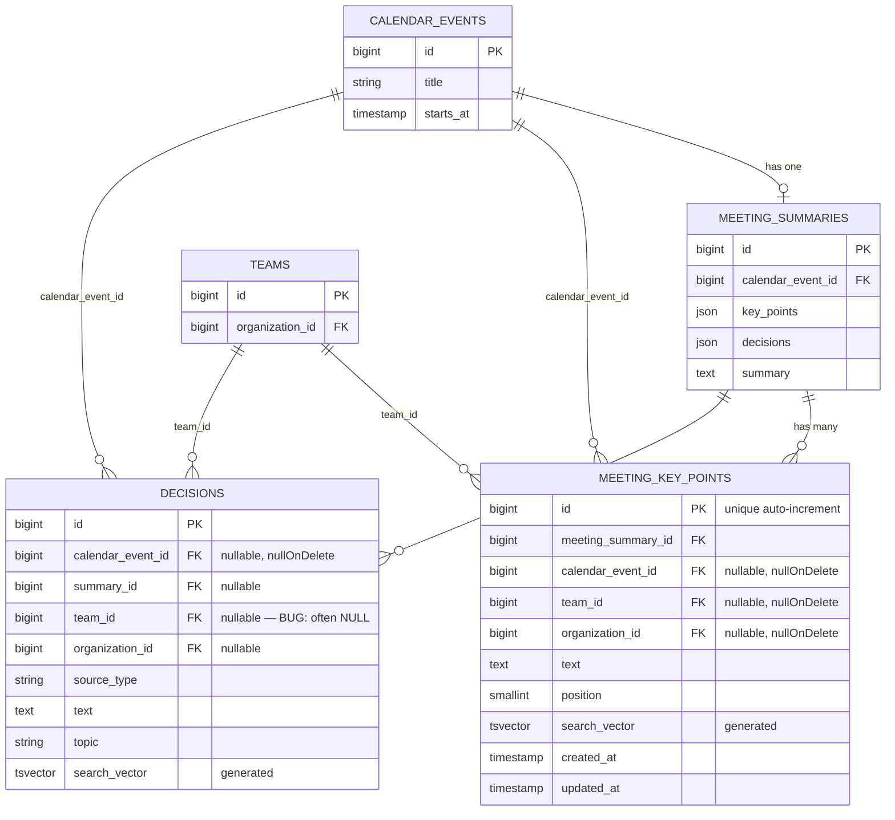

# feat: Meeting Key Points Table + Decisions Backfill Job

## Overview

The **Decisions tab** in the team dashboard is empty despite data existing in
the database. This plan covers two parallel tracks:

1. **Root cause fix** — decisions are created with `team_id = NULL` due to a
   fallback in `resolveTeamContexts()`, making them invisible in team-scoped
   queries.
2. **New feature** — a dedicated `meeting_key_points` table (with unique IDs) to
   normalize key points from `meeting_summaries.key_points` JSON, plus a
   backfill job and a new API endpoint, so the frontend table can display Key
   Points alongside Decisions.

---

## Problem Statement

### Why the tab is empty

```
meetings → meeting_summaries → ExtractDecisionsService → decisions table
                                        ↓
                          resolveTeamContexts() can't match
                          participants to team users
                                        ↓
                          fallback: team_id = NULL, org_id = NULL
                                        ↓
                   Decision records created but team-scoped query
                   WHERE team_id = :teamId returns 0 rows
```

**File:** `app/Services/Decisions/ExtractDecisionsService.php`

```php
// Line ~107 — the fallback that orphans decisions
if ($userIds->isEmpty()) {
    return [[null, null]];  // team_id = NULL → invisible in team view
}
```

The `BackfillDecisionsCommand`
(`app/Console/Commands/BackfillDecisionsCommand.php`) also uses the same
`extract()` method, so running it again without fixing the resolution logic
still produces orphaned records.

### Why key_points need their own table

`meeting_summaries.key_points` is a JSON string array — no IDs, no team context,
not queryable independently. Each key point must become a first-class record so
the frontend can display, paginate and search them alongside decisions.

---

## Proposed Solution

### Track A — Fix `resolveTeamContexts()` fallback

Modify `ExtractDecisionsService::resolveTeamContexts()` so that when no
participant can be linked to a team, it attempts resolution via the **calendar
event's organization** directly:

```php
// Fallback: find organization from event's creator or calendar integration
if ($teams->isEmpty()) {
    $orgId = \App\Models\User::whereIn('id', $userIds)
        ->with('organizations')
        ->get()
        ->flatMap(fn ($u) => $u->organizations->pluck('id'))
        ->first();

    // NEW: Also try to find teams within that org, not just org-level
    if ($orgId) {
        $teamsInOrg = \App\Models\Team::where('organization_id', $orgId)
            ->get(['id', 'organization_id']);
        if ($teamsInOrg->isNotEmpty()) {
            return $teamsInOrg->map(fn ($t) => [$t->id, $t->organization_id])->all();
        }
    }

    return [[null, $orgId ?? null]];
}
```

This ensures decisions at least get an `organization_id`, and ideally a
`team_id`. After this fix, re-run the backfill command to repair existing
orphaned records.

### Track B — `meeting_key_points` table

New normalized table where each row is one key point from one meeting.

---

## Technical Approach

### Architecture

```
meeting_summaries.key_points (JSON [])
        ↓  (backfill job reads this)
meeting_key_points table
  id (PK, bigint, auto-increment)
  meeting_summary_id (FK → meeting_summaries)
  calendar_event_id (FK → calendar_events, nullable, nullOnDelete)
  team_id (FK → teams, nullable, nullOnDelete)
  organization_id (FK → organizations, nullable, nullOnDelete)
  text (text, NOT NULL)
  position (integer) — order within the summary
  created_at, updated_at
  search_vector (generated tsvector, GIN index)
```

### Implementation Phases

#### Phase 1 — Backend: Migration + Model + Resource

**New files (backend at `/Users/slavapopov/Documents/WandaAsk_backend`):**

```
database/migrations/
  2026_04_30_XXXXXX_create_meeting_key_points_table.php

app/Models/
  MeetingKeyPoint.php

app/Http/Resources/API/v1/
  MeetingKeyPointResource.php
```

**Migration schema (`create_meeting_key_points_table.php`):**

```php
Schema::create('meeting_key_points', function (Blueprint $table) {
    $table->id();  // unique bigint PK — required by the user
    $table->foreignId('meeting_summary_id')
          ->constrained('meeting_summaries')
          ->cascadeOnDelete();
    $table->foreignId('calendar_event_id')
          ->nullable()
          ->constrained('calendar_events')
          ->nullOnDelete();
    $table->unsignedBigInteger('team_id')->nullable();
    $table->unsignedBigInteger('organization_id')->nullable();
    $table->text('text');
    $table->unsignedSmallInteger('position')->default(0);
    $table->foreign('team_id')->references('id')->on('teams')->nullOnDelete();
    $table->foreign('organization_id')->references('id')->on('organizations')->nullOnDelete();
    $table->index(['team_id', 'created_at']);
    $table->index(['organization_id', 'created_at']);
    $table->timestamps();
});

// Full-text search vector (same pattern as decisions table)
DB::statement("ALTER TABLE meeting_key_points ADD COLUMN search_vector tsvector
    GENERATED ALWAYS AS (to_tsvector('simple', coalesce(text, ''))) STORED");
DB::statement('CREATE INDEX meeting_key_points_search_gin ON meeting_key_points USING GIN (search_vector)');
```

**Model (`MeetingKeyPoint.php`):**

```php
class MeetingKeyPoint extends Model
{
    protected $fillable = [
        'meeting_summary_id', 'calendar_event_id', 'team_id',
        'organization_id', 'text', 'position',
    ];

    public function summary(): BelongsTo { return $this->belongsTo(MeetingSummary::class, 'meeting_summary_id'); }
    public function calendarEvent(): BelongsTo { return $this->belongsTo(CalendarEvent::class); }
    public function team(): BelongsTo { return $this->belongsTo(Team::class); }
}
```

**Resource (`MeetingKeyPointResource.php`):**

```php
return [
    'id'               => $this->id,
    'text'             => $this->text,
    'position'         => $this->position,
    'team_id'          => $this->team_id,
    'organization_id'  => $this->organization_id,
    'calendar_event'   => $this->whenLoaded('calendarEvent', fn () => [
        'id'        => $this->calendarEvent->id,
        'title'     => $this->calendarEvent->title,
        'starts_at' => $this->calendarEvent->starts_at,
    ]),
    'created_at'       => $this->created_at,
    'updated_at'       => $this->updated_at,
];
```

---

#### Phase 2 — Backend: Backfill Job + Service

**New files:**

```
app/Services/Decisions/
  ExtractKeyPointsService.php       ← mirrors ExtractDecisionsService pattern

app/Console/Commands/
  BackfillKeyPointsCommand.php      ← mirrors BackfillDecisionsCommand pattern

app/Jobs/
  BackfillKeyPointsJob.php          ← queueable wrapper (optional)
```

**`ExtractKeyPointsService::extract(MeetingSummary $summary): int`**

```php
public function extract(MeetingSummary $summary): int
{
    $rawPoints = $summary->key_points ?? [];
    if (empty($rawPoints)) return 0;

    $event = $summary->calendarEvent;
    $teamContexts = $event
        ? $this->resolveTeamContexts($event)  // same as in ExtractDecisionsService
        : [[null, null]];

    return DB::transaction(function () use ($summary, $event, $rawPoints, $teamContexts) {
        // Idempotent: delete & re-insert
        MeetingKeyPoint::where('meeting_summary_id', $summary->id)->delete();

        $created = 0;
        foreach ($rawPoints as $position => $text) {
            $text = trim(is_string($text) ? $text : ($text['text'] ?? ''));
            if ($text === '') continue;

            foreach ($teamContexts as [$teamId, $organizationId]) {
                MeetingKeyPoint::create([
                    'meeting_summary_id' => $summary->id,
                    'calendar_event_id'  => $event?->id,
                    'team_id'            => $teamId,
                    'organization_id'    => $organizationId,
                    'text'               => $text,
                    'position'           => $position,
                ]);
                $created++;
            }
        }
        return $created;
    });
}
```

**`BackfillKeyPointsCommand.php` signature:**

```
decisions:backfill-key-points
  {--summary-id= : Process only this summary id}
  {--skip-existing : Skip summaries that already have key points in meeting_key_points}
```

Same pattern as `BackfillDecisionsCommand` — iterate all `MeetingSummary`
records where `key_points IS NOT NULL AND key_points != '[]'`.

---

#### Phase 3 — Backend: API Endpoint

Add route in `routes/api.php` (same throttle group as decisions):

```php
Route::middleware('throttle:60,1')->group(function () {
    Route::get('teams/{team}/key-points', [TeamKeyPointController::class, 'index']);
});
```

**New controller:**

```
app/Http/Controllers/API/v1/
  TeamKeyPointController.php
```

```php
class TeamKeyPointController extends Controller
{
    public function index(Request $request, Team $team): JsonResponse
    {
        $this->authorize('view', $team);

        $query = MeetingKeyPoint::where('team_id', $team->id)
            ->with('calendarEvent');

        // Search via full-text
        if ($search = $request->input('search')) {
            $query->whereRaw("search_vector @@ plainto_tsquery('simple', ?)", [$search]);
        }

        $limit  = min((int) $request->input('limit', 20), 100);
        $offset = (int) $request->input('offset', 0);

        $total  = $query->count();
        $items  = $query->orderByDesc('created_at')->offset($offset)->limit($limit)->get();

        return response()->json([
            'success' => true,
            'data'    => MeetingKeyPointResource::collection($items),
            'message' => '',
            'status'  => 200,
            'meta'    => [],
        ])->header('Items-Count', $total);
    }
}
```

---

#### Phase 4 — Fix Existing Orphaned Decisions

After fixing `resolveTeamContexts()` in `ExtractDecisionsService`, run:

```bash
# On backend server:
php artisan decisions:backfill --skip-existing  # skip already-linked ones
php artisan decisions:backfill-key-points        # new command for key points
```

This will re-process all summaries and create properly team-scoped records.

---

#### Phase 5 — Frontend: Key Points API + Updated Table

**New frontend files:**

```
features/decisions/api/key-points.ts          ← Server Action for GET /teams/{id}/key-points
features/decisions/model/types.ts             ← Add MeetingKeyPoint interface
features/decisions/ui/decisions-table.tsx     ← Already updated; extend to accept type column
```

**`features/decisions/api/key-points.ts`:**

```ts
'use server';
import { httpClientList } from '@/shared/lib/httpClient';
const API_URL = process.env.NEXT_PUBLIC_API_URL;

export interface MeetingKeyPoint {
  id: number;
  text: string;
  position: number;
  team_id: number | null;
  organization_id: number | null;
  calendar_event: { id: number; title: string; starts_at: string } | null;
  created_at: string;
  updated_at: string;
}

export async function getKeyPoints(
  teamId: number,
  params?: {
    search?: string | null;
    offset?: number;
    limit?: number;
  },
) {
  return httpClientList<MeetingKeyPoint>(
    `${API_URL}/teams/${teamId}/key-points`,
    { params },
  );
}
```

**`DecisionsPage` update:** Add a mode toggle or a combined view showing both
key points and decisions in the same table (with a `type` column distinguishing
them).

Alternatively, the `decisions-page.tsx` component can render two sections:

- "Key Points" section → `<DecisionsTable>` with key point rows
- "Decisions" section → `<DecisionsTable>` with decision rows

---

## ERD Diagram



---

## Acceptance Criteria

### Backend

- [x] Migration `create_meeting_key_points_table` runs cleanly with
      `php artisan migrate`
- [x] Each `meeting_key_points` row has a unique auto-increment `id`
- [x] `ExtractKeyPointsService::extract()` is idempotent (re-run safe)
- [x] `BackfillKeyPointsCommand` processes all `meeting_summaries` with
      non-empty `key_points`
- [x] `GET /api/v1/teams/{team}/key-points` returns key points scoped to
      `team_id`, paginated, with `Items-Count` header
- [x] Full-text search works via `?search=term`
- [x] `ExtractDecisionsService::resolveTeamContexts()` fixed — existing orphaned
      decisions updated via backfill re-run

### Frontend

- [x] Decisions tab shows rows from `/teams/{id}/decisions`
- [x] Key points section visible in the same tab, pulling from
      `/teams/{id}/key-points`
- [x] Table columns: Key Point / Decision | Event | Date | Source
- [x] Empty state shown when both endpoints return 0 rows

---

## Files to Create / Modify

### Backend (`/Users/slavapopov/Documents/WandaAsk_backend`)

| Action | File                                                                                        |
| ------ | ------------------------------------------------------------------------------------------- |
| CREATE | `database/migrations/2026_04_30_XXXXXX_create_meeting_key_points_table.php`                 |
| CREATE | `app/Models/MeetingKeyPoint.php`                                                            |
| CREATE | `app/Http/Resources/API/v1/MeetingKeyPointResource.php`                                     |
| CREATE | `app/Http/Controllers/API/v1/TeamKeyPointController.php`                                    |
| CREATE | `app/Services/Decisions/ExtractKeyPointsService.php`                                        |
| CREATE | `app/Console/Commands/BackfillKeyPointsCommand.php`                                         |
| MODIFY | `app/Services/Decisions/ExtractDecisionsService.php` — fix `resolveTeamContexts()` fallback |
| MODIFY | `routes/api.php` — add `GET teams/{team}/key-points`                                        |

### Frontend (`/Users/slavapopov/Documents/WandaAsk_frontend`)

| Action | File                                                                     |
| ------ | ------------------------------------------------------------------------ |
| CREATE | `features/decisions/api/key-points.ts`                                   |
| MODIFY | `features/decisions/model/types.ts` — add `MeetingKeyPoint` interface    |
| MODIFY | `features/decisions/ui/decisions-page.tsx` — add key points section      |
| MODIFY | `features/decisions/ui/decisions-table.tsx` — support both types in rows |

---

## Verification

1. **Backend migrate:** `cd WandaAsk_backend && php artisan migrate`
2. **Backfill decisions:** `php artisan decisions:backfill --skip-existing`
3. **Backfill key points:** `php artisan decisions:backfill-key-points`
4. **API test:**
   ```bash
   curl -H "Authorization: Bearer <token>" \
     https://dev-api.shrugged.ai/api/v1/teams/<id>/key-points
   ```
5. **Frontend:** Navigate to `/dashboard/teams?tab=decisions` — should show
   non-empty table with Key Points and Decisions sections
6. **Run tests:** `npm test -- --passWithNoTests`
7. **Run lint:** `npm run lint`

---

## Risk Analysis

| Risk                                               | Likelihood | Mitigation                                                                               |
| -------------------------------------------------- | ---------- | ---------------------------------------------------------------------------------------- |
| `resolveTeamContexts()` fix breaks existing logic  | Medium     | Cover with tests; run backfill with `--skip-existing` first to see count change          |
| Backfill creates duplicate rows                    | Low        | `MeetingKeyPoint::where('meeting_summary_id', $id)->delete()` before insert — idempotent |
| LLM returned non-string items in `key_points` JSON | Low        | `is_string($text)` guard in `ExtractKeyPointsService`                                    |
| Frontend API contract mismatch                     | Low        | Run `backend-contract-validator` agent after writing TypeScript types                    |
