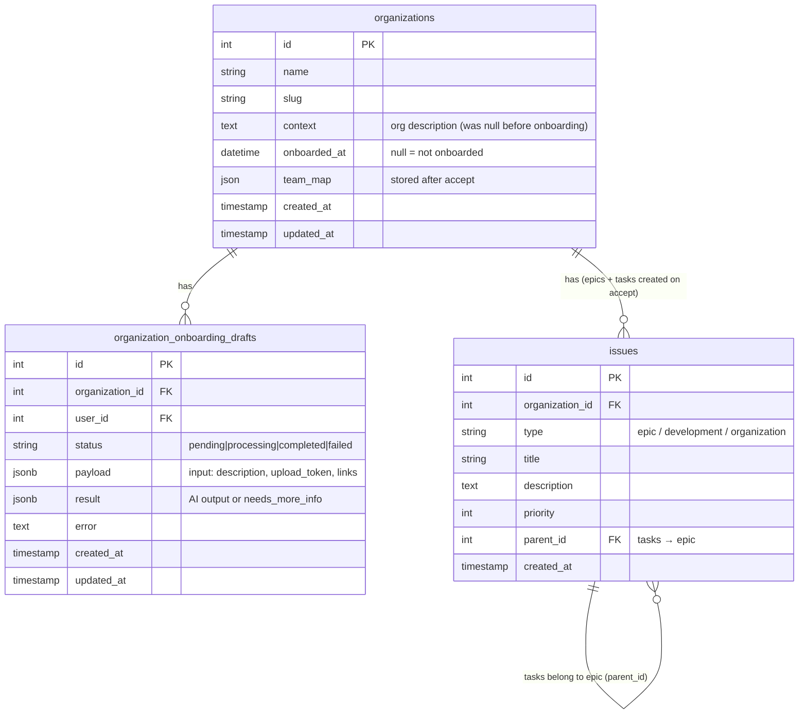

# Organization Onboarding Wizard

## Overview

A new user who has just registered and created their organization lands on a
dedicated onboarding page where they describe their team and goals in free text
(or attach files/links). The AI backend processes this asynchronously and
returns a structured preview. The user reviews and edits the preview, then
accepts — saving an org profile and creating epics/tasks in the issue tracker.
Alternatively the user can skip, leaving the org description empty.

**Job-to-be-done:** "I want to tell the system about my team in 10 minutes using
plain text, and have it figure out the structure that all agents will use."

---

## Problem Statement / Motivation

- Every new AI tool demands manual form-filling (roles, projects, OKRs) that
  takes an hour and becomes stale within a week.
- Without this context, AI recommendations are generic and unhelpful.
- The backend already has complete infrastructure: `OrganizationOnboardingDraft`
  model, `GenerateOrganizationStructureJob`,
  `CombinedOnboardingGenerationService`, three API endpoints. Frontend is
  entirely missing.

---

## API Contract (verified from backend source)

Three endpoints, all scoped to an authenticated org member via
`Gate::authorize('update', $organization)`:

| Method | URL                                                 | Purpose                   |
| ------ | --------------------------------------------------- | ------------------------- |
| `POST` | `/api/v1/organizations/{org_id}/generate-structure` | Start async AI generation |
| `GET`  | `/api/v1/organizations/{org_id}/drafts/latest`      | Poll for draft status     |
| `POST` | `/api/v1/organizations/{org_id}/accept-structure`   | Commit structure to DB    |

Plus the existing attachment endpoint (already implemented in
`features/issues/`):

| Method   | URL                                        | Purpose                                            |
| -------- | ------------------------------------------ | -------------------------------------------------- |
| `POST`   | `/api/v1/attachments/pending`              | Upload a file (multipart: `file` + `upload_token`) |
| `DELETE` | `/api/v1/attachments/pending/{attachment}` | Remove a pending file                              |

### Request: `POST generate-structure`

```ts
// GenerateOrganizationStructureRequest
interface GenerateStructurePayload {
  description?: string; // nullable, max 10 000 chars
  upload_token?: string; // nullable, UUID v4 — groups all pending uploads for this session
  links?: string[]; // nullable, max 5 items; each valid URL, max 2048 chars
}
```

> **CRITICAL:** `upload_token` is a UUID v4 generated **client-side** via
> `crypto.randomUUID()` inside a `useEffect` (NOT at module/render time — SSR
> produces a different UUID than hydration, causing mismatch). Generate once in
> an effect on mount, store in state, reuse for all uploads and for re-generate
> after `needs_more_info`. Never regenerate mid-session.

### Response: `POST generate-structure`

```ts
{
  draft_id: number;
  status: 'pending';
} // status literal, not string
```

### Response: `GET drafts/latest`

```ts
interface OnboardingDraftResponse {
  id: number;
  status: 'pending' | 'processing' | 'completed' | 'failed';
  error: string | null;
  result: OnboardingDraftResult | null; // null until completed
}

// When completed and AI had sufficient information:
interface OnboardingDraftResultComplete {
  organization: { name: string; description: string };
  goals: Array<{
    title: string;
    description: string;
    tasks: Array<{
      title: string;
      description: string;
      type: 'development' | 'organization';
      priority: number; // 0 = PRIORITY_NORMAL
    }>;
  }>;
  team: Array<{
    name: string;
    email: string | null;
    role: string | null;
    found_in: string[]; // e.g. ['github', 'documents', 'transcripts']
    already_in_system: boolean; // enriched by backend against existing Participant records
    system_user_id: number | null;
  }>;
}

// When completed but AI needs more info:
interface OnboardingDraftResultNeedsInfo {
  needs_more_info: true;
  message: string;
  questions: string[];
}

type OnboardingDraftResult =
  | OnboardingDraftResultComplete
  | OnboardingDraftResultNeedsInfo;
```

**404 behavior:** `GET drafts/latest` uses `firstOrFail()` — returns 404 when no
draft exists. Treat 404 as "no draft yet → show input form." Do NOT surface this
as an error.

**Type guard helper:**

```ts
function isNeedsMoreInfo(
  r: OnboardingDraftResult,
): r is OnboardingDraftResultNeedsInfo {
  return 'needs_more_info' in r && r.needs_more_info === true;
}
```

> **Route Handler validation:** The polling Route Handler returns
> `OnboardingDraftResponse`. Validate with Zod at the Route Handler boundary
> before forwarding to the client — a plain `as OnboardingDraftResponse` cast in
> the hook is a runtime hole. Parse the backend response through
> `onboardingDraftResponseSchema` in `route.ts` and return the parsed value.

### Request: `POST accept-structure`

```ts
interface AcceptStructurePayload {
  organization: {
    name: string; // required, max 255
    description: string; // required, max 10 000 — stored as model.context on backend
  };
  goals: Array<{
    // required, min 1, max 20
    title: string; // required, max 255
    description?: string; // nullable, max 2 000
    tasks?: Array<{
      // nullable, max 20 per goal
      title: string; // required, max 255
      description?: string; // nullable, max 2 000
      type?: 'development' | 'organization'; // defaults to 'development'
      priority?: number; // defaults to 0 (Issue::PRIORITY_NORMAL)
    }>;
  }>;
  team?: Array<{
    // nullable — only name/email/role sent (not already_in_system)
    name: string; // required, max 255
    email?: string; // nullable, email format
    role?: string; // nullable, max 255
  }>;
}
```

### Response: `POST accept-structure`

```ts
interface AcceptStructureResponse {
  id: number;
  name: string;
  slug: string;
  context: string; // org description — field name is 'context', NOT 'description'
  onboarded_at: string; // ISO 8601
}
```

**Error cases:**

- `422` already onboarded: `"Онбординг для этой организации уже был проведён"` →
  show `"Organization is already set up."`, redirect to dashboard
- `422` epic type not configured: `"Тип эпика не настроен в системе."` → show
  `"Organization setup cannot be completed right now. Please contact support."`

---

## User Flow

### Entry Point

`selectOrganizationAction` (in `features/organization/api/organization.ts`)
currently sets the `organization_id` cookie and immediately redirects to
`ROUTES.DASHBOARD.TODAY`. Modify it to fetch the org data after setting the
cookie, check `onboarded_at`, and redirect to `ROUTES.ONBOARDING` when null.

The `app/dashboard/layout.tsx` acts as a secondary guard: fetch the current org
server-side and redirect to `/onboarding` if `onboarded_at === null`. This
catches users who navigate directly to a dashboard route. Dashboard layout is
the right place — not `middleware.ts`, because the Edge runtime cannot call
`httpClient` (which requires Node.js APIs), and not individual page components
(creates gaps on new pages).

The `/onboarding` page itself should redirect to dashboard if `onboarded_at` is
already set.

### Step 1 — Input

User sees:

- **Textarea** with placeholder "Describe your team: who you are, what you
  build, who's on the team, and your goals. Write freely — we'll structure it."
  Live character counter below: `N / 10,000`. Counter turns amber when fewer
  than 500 characters remain. `aria-live="polite"` on the counter for screen
  reader support. Do NOT use HTML `maxLength` alone — pair it with the visible
  counter.
- **File attach area**: accepts `.pdf,.docx,.md,.txt`, max 3 files, max 10 MB
  each. Each uploaded file shows: original name, file size, spinner while
  uploading, × button to remove. Client validates size and extension before
  upload.
- **URL slots**: 0–5 URL text inputs. "Add link" button appends a slot (disabled
  when 5 reached). Each slot has a × button to remove. Per-slot inline
  validation error shown if URL format is invalid.
- **"Generate" primary button** (disabled if empty submit — no description, no
  files, no links).
- **"Skip for now" link** at bottom.

### Step 2 — Processing

- Trigger: user clicks "Generate".
- POST `generate-structure` with `{ description, upload_token, links }`.
- Display: spinner + "Analyzing your organization..." text. If polling
  transitions from `pending` to `processing`, update text to "Generating
  structure...".
- Poll `GET drafts/latest` via a **GET Route Handler** every **5 seconds**, max
  **180 attempts (15 minutes)**.
- "Cancel" button stops polling and returns to Step 1 with all input preserved.
- If polling times out: show "Generation is taking longer than expected. You can
  keep waiting or skip for now." with "Keep waiting" (resets counter, resumes
  polling) and "Skip for now" buttons.

### Step 3A — Preview (Full Result)

When polling returns `status: 'completed'` and `!isNeedsMoreInfo(result)`:

- **Org card**: editable name (`<Input>`, max 255) + editable description
  (`<InputTextarea>`, max 10 000, with character counter).
- **Goals list**: each goal has editable title + editable description. Below
  each goal, a collapsible section showing tasks (read-only: title + type
  badge). Delete goal (×). "Add goal" inline button at bottom. **Minimum 1 goal
  must remain — disable "Accept" and show inline error when 0 goals.**
- **Team members list**: each row shows name, email, role, `found_in` tags, and
  "Already in Wanda" `<Badge variant="success">` if `already_in_system: true`.
  Delete member (×). "Add member" expands an inline mini-form (name required,
  email optional, role optional).
- **"Accept" primary button** + **"Edit input" secondary button** (returns to
  Step 1 with input preserved, same `upload_token`) + **"Skip for now" link**.

### Step 3B — Needs More Info

When `isNeedsMoreInfo(result)`:

- Show the AI's `message` string as a callout.
- Show `questions[]` as a numbered list.
- Textarea pre-filled with previous description.
- Same file list (same `upload_token`) and URL inputs preserved.
- **"Regenerate" primary button** + **"Skip for now" link**.

### Step 3C — Failed

When `status: 'failed'`:

- Show generic English message: "We couldn't analyze your input. This can happen
  with complex links or an unusually long description."
- `draft.error` may contain Russian text from the backend — do NOT display it to
  the user. Log it in dev.
- **"Try again" button** → returns to Step 1 with previous input preserved.
- **"Skip for now" link**.

### Step 4 — Accept

- User clicks "Accept".
- Strip `already_in_system` and `system_user_id` from team members before
  sending (backend does not accept those fields).
- POST `accept-structure` with edited payload.
- Button shows `loading` state ("Saving..."). Guard against double-submit via
  reducer `isAccepting` flag.
- On success: `toast.success("Your organization is all set!")` →
  `revalidatePath('/dashboard')` → redirect to `ROUTES.DASHBOARD.TODAY`.
- On 422 (already onboarded): `toast.error("Organization is already set up.")` →
  redirect to `ROUTES.DASHBOARD.TODAY`.
- On 422 (epic type not configured): show inline error "Organization setup
  cannot be completed right now. Please contact support."

### Skip

At any step, "Skip for now":

- No API call.
- Redirect to `ROUTES.DASHBOARD.TODAY`.
- No server-side state change — the user will see the onboarding wizard again
  next time if the dashboard guard is active. Keep the guard simple: only
  redirect on first login, not on every dashboard visit (use a session flag or
  detect via `onboarded_at === null` combined with a "skipped" session marker in
  `sessionStorage`).

---

## Technical Approach

### Layout

`/onboarding` lives **outside** the dashboard layout. Create
`app/onboarding/layout.tsx` — a centered minimal shell following the same
pattern as `app/auth/layout.tsx` (no sidebar, no topbar, centered card). The
auth layout uses a two-column grid with a decorative left column — onboarding
can use a simpler single-column centered layout since it's more interactive (not
a login form).

```
app/
  onboarding/
    layout.tsx        # minimal centered layout, no dashboard chrome
    page.tsx          # Server Component: pre-fetches draft, passes initialDraft to wizard
    loading.tsx       # Skeleton placeholder
```

The `page.tsx` Server Component pre-fetches the latest draft and the current org
**in parallel** via `Promise.all`, then passes both as props to
`OnboardingWizard`. This avoids a client-side fetch on mount and eliminates the
flash of the input form when the user refreshes during processing.

```ts
// app/onboarding/page.tsx
const [org, initialDraft] = await Promise.all([
  getCurrentOrg(orgId),
  getLatestDraftOrNull(orgId), // returns null on 404, does NOT throw
]);
if (org.onboarded_at) redirect(ROUTES.DASHBOARD.TODAY);
```

Use `Promise.all` — sequential awaits add ~100ms latency per call with no
benefit.

### FSD Feature Slice

```
features/onboarding/
  api/
    onboarding.ts        # generateStructure, acceptStructure Server Actions ('use server')
    attachments.ts       # uploadPendingAttachment, deletePendingAttachment Server Actions
  model/
    types.ts             # all TypeScript interfaces (from backend contracts above)
    schemas.ts           # Zod v4 schemas (also used by Route Handler for validation)
  ui/
    onboarding-wizard.tsx          # Client Component: WizardState reducer at top of file
                                   # + step machine + inline error/timeout states
    onboarding-input-step.tsx      # Steps 1 + 3B combined: textarea + files + URL slots
                                   # optional `needsInfoData` prop shows AI questions above textarea
    onboarding-processing-step.tsx # Step 2: spinner, status text, cancel, timeout UI
    onboarding-preview-step.tsx    # Step 3A: editable org card + goals + team
    onboarding-goal-card.tsx       # Editable single goal with collapsible read-only tasks
    onboarding-team-member-row.tsx # Editable/deletable team member row
    onboarding-file-upload.tsx     # File picker (mirrors PendingAttachmentUploader pattern)
                                   # URL slots inlined here (~25 lines, no independent reuse)
  hooks/
    use-onboarding-poll.ts         # GET Route Handler polling, cleanup, timeout
  index.ts
```

> **Simplifications from technical review (applied before implementation):**
>
> - `onboarding-needs-info-step.tsx` **eliminated** — merged into
>   `onboarding-input-step.tsx` via optional `needsInfoData?: NeedsInfoData`
>   prop
> - `onboarding-error-step.tsx` **eliminated** — inlined as ~15 lines JSX in
>   `onboarding-wizard.tsx`
> - `onboarding-url-slots.tsx` **eliminated** — inlined in
>   `onboarding-input-step.tsx` (~25 lines)
> - `model/reducer.ts` separate file **eliminated** — reducer lives at top of
>   `onboarding-wizard.tsx` (single consumer)
> - `sessionStorage` draft_id persistence **eliminated** — Server Component
>   `initialDraft` prop handles refresh scenario
> - **Total: 10 files → 6 UI files**

**Reuse `PendingAttachmentUploader` pattern from
`features/issues/ui/pending-attachment-uploader.tsx`** — same 10 MB guard,
upload token flow, and `onPendingChange` callback shape. Copy the pattern into
`onboarding-file-upload.tsx`.

### Polling: GET Route Handler (not Server Action)

> **Architecture decision:** Server Actions are always HTTP POST. Calling a
> Server Action inside a 5-second polling loop generates up to 180 POST requests
> with full framework dispatch overhead. For a read-only status poll this is
> architectural misuse. Use a GET Route Handler instead.

Create `app/api/onboarding/draft/route.ts`:

```ts
// app/api/onboarding/draft/route.ts
export async function GET(request: Request) {
  const { searchParams } = new URL(request.url);
  const orgId = searchParams.get('orgId');
  if (!orgId) return Response.json({ error: 'Missing orgId' }, { status: 400 });
  const headers = await getAuthHeaders(); // from shared/lib
  const res = await fetch(
    `${process.env.API_URL}/organizations/${orgId}/drafts/latest`,
    { headers, cache: 'no-store' }, // explicit: never cache a status-poll response
  );
  if (res.status === 404) return Response.json({ status: 'not_found' });
  const json = await res.json();
  // Validate before forwarding — do NOT trust the backend shape blindly
  const parsed = onboardingDraftResponseSchema.safeParse(json.data);
  if (!parsed.success)
    return Response.json({ error: 'Invalid response' }, { status: 502 });
  return Response.json(parsed.data);
}
```

The polling hook calls `fetch('/api/onboarding/draft?orgId=...')` and receives a
typed, validated response. The `cache: 'no-store'` on the inner fetch is
mandatory — without it, a future `next.config.ts` change could silently cache a
stale `pending` status, locking the wizard in the processing step.

### State Machine: `useReducer`

Using `useReducer` with a discriminated union prevents intermediate renders
where step and data are out of sync (e.g., step transitions to `preview` but
`previewData` isn't populated yet). All state mutations are atomic.

The reducer is defined **at the top of `onboarding-wizard.tsx`** — it has one
consumer and extracting it to a separate file adds file overhead without
benefit.

```ts
// Top of onboarding-wizard.tsx — WizardState discriminated union

// Derive isAccepting from step — do NOT add a separate boolean flag
// state.step === 'accepting' is the single source of truth for double-submit guard

type WizardState =
  | { step: 'input'; inputState: InputState }
  | { step: 'processing'; inputState: InputState; draftId: number | null }
  | { step: 'timeout'; inputState: InputState } // separate step, distinct UX from 'error'
  | { step: 'preview'; inputState: InputState; previewData: PreviewData }
  | { step: 'needs-info'; inputState: InputState; needsInfoData: NeedsInfoData }
  | { step: 'error'; inputState: InputState; errorMessage: string }
  | { step: 'accepting'; previewData: PreviewData };
//   ^^^ 'accepting' step replaces isAccepting flag — derive disabled state from step

type WizardAction =
  | { type: 'GENERATE_STARTED'; draftId: number }
  | { type: 'POLL_COMPLETE'; result: OnboardingDraftResultComplete }
  | { type: 'POLL_NEEDS_INFO'; result: OnboardingDraftResultNeedsInfo }
  | { type: 'POLL_FAILED'; error: string }
  | { type: 'POLL_TIMEOUT' } // → step: 'timeout' (NOT 'error', different UX)
  | { type: 'CANCEL_POLLING' }
  | { type: 'KEEP_WAITING' } // from timeout state: reset counter, resume polling
  | { type: 'EDIT_INPUT' }
  | { type: 'UPDATE_PREVIEW'; previewData: PreviewData }
  | { type: 'ACCEPT_STARTED' } // → step: 'accepting'
  | { type: 'ACCEPT_FAILED'; error: string }
  | { type: 'SET_UPLOAD_TOKEN'; token: string };

interface InputState {
  description: string;
  uploadToken: string | null; // null until useEffect fires post-mount
  links: string[];
  attachments: PendingAttachment[];
}

interface PreviewData {
  organization: { name: string; description: string };
  goals: EditableGoal[];
  team: EditableTeamMember[];
}
```

> **Review findings applied:**
>
> - `step: 'timeout'` added as distinct variant (different buttons: "Keep
>   waiting" vs "Try again" on error)
> - `isAccepting` flag removed — derive from `state.step === 'accepting'` at
>   render sites
> - `KEEP_WAITING` action added to reset poll counter from timeout state
> - `POLL_TIMEOUT` maps to `'timeout'` step, never to `'error'` — prevents type
>   narrowing confusion

### Polling Hook

**`features/onboarding/hooks/use-onboarding-poll.ts`:**

```ts
const POLL_INTERVAL_MS = 5_000;
const POLL_MAX_ATTEMPTS = 180; // 15 minutes

export function useOnboardingPoll(
  orgId: number,
  enabled: boolean,
  onResult: (draft: OnboardingDraftResponse) => void,
  onTimeout: () => void,
) {
  const stoppedRef = useRef(false);
  const attemptsRef = useRef(0);
  // Store onResult/onTimeout in refs to avoid stale closures.
  // If onResult were captured directly in the effect closure, an inline arrow
  // (e.g. dispatching to a reducer) would always call the first closure version.
  const onResultRef = useRef(onResult);
  const onTimeoutRef = useRef(onTimeout);
  useEffect(() => {
    onResultRef.current = onResult;
  }, [onResult]);
  useEffect(() => {
    onTimeoutRef.current = onTimeout;
  }, [onTimeout]);

  useEffect(() => {
    if (!enabled) return;
    stoppedRef.current = false;
    attemptsRef.current = 0;

    async function poll() {
      if (stoppedRef.current) return;
      if (attemptsRef.current >= POLL_MAX_ATTEMPTS) {
        onTimeoutRef.current(); // dispatch POLL_TIMEOUT — no synthetic response object
        return;
      }
      attemptsRef.current++;
      try {
        const res = await fetch(`/api/onboarding/draft?orgId=${orgId}`);
        const data: OnboardingDraftResponse = await res.json();
        onResultRef.current(data);
        if (data.status === 'completed' || data.status === 'failed') return;
      } catch {
        /* network error — keep polling */
      }
      if (!stoppedRef.current) setTimeout(poll, POLL_INTERVAL_MS);
    }

    setTimeout(poll, POLL_INTERVAL_MS);
    return () => {
      stoppedRef.current = true;
    };
  }, [orgId, enabled]);
}
```

> **Review findings applied:**
>
> - `onResult` and `onTimeout` captured via `useRef` — prevents stale closures
>   when the dispatch function identity changes between renders
> - `onTimeout` is a separate callback dispatching `POLL_TIMEOUT` — removes the
>   synthetic `{ id: 0, status: 'failed', error: '__timeout__' }` object (using
>   `id: 0` was semantically wrong and `0` is falsy)
> - Caller: `wizard` passes `() => dispatch({ type: 'POLL_TIMEOUT' })` as
>   `onTimeout`

The `stoppedRef` flag pattern matches `artifact-panel.tsx`. The `enabled` flag
lets the wizard start/stop polling by toggling based on step state.

### File Upload

**Generate `uploadToken` inside `useEffect`:**

```ts
// In onboarding-wizard.tsx
useEffect(() => {
  dispatch({ type: 'SET_UPLOAD_TOKEN', token: crypto.randomUUID() });
}, []);
```

Do NOT generate at render time — SSR produces a different UUID than hydration.

Reuse the pattern from `features/issues/ui/pending-attachment-uploader.tsx`:

- Hidden
  `<input type="file" accept=".pdf,.docx,.md,.txt" multiple ref={fileInputRef} />`
- Client validates: `file.size > 10 * 1024 * 1024` → reject with inline error
- Call `uploadPendingAttachment(formData)` Server Action (returns
  `ActionResult<PendingAttachment>`)
- Track in-flight uploads via a `Set` of local op IDs
- On remove: call `deletePendingAttachment(attachment.id)`, remove from
  `attachments[]` in state

### TypeScript Types

**`features/onboarding/model/types.ts`** — full interfaces, no stubs:

```ts
export type DraftStatus = 'pending' | 'processing' | 'completed' | 'failed';
export type TaskType = 'development' | 'organization';

// Matches IssueAttachmentResource from backend (storePending endpoint)
export interface PendingAttachment {
  id: number;
  original_name: string | null;
  file_name?: string | null; // fallback display name — check IssueAttachmentResource
  file_url?: string | null; // optional on pending attachments
  upload_token: string;
  uploaded_at: string;
}
// Display name helper: attachment.original_name ?? attachment.file_name ?? `#${attachment.id}`

export interface InputState {
  description: string;
  uploadToken: string | null;
  links: string[];
  attachments: PendingAttachment[];
}

export interface OnboardingDraftResponse {
  id: number;
  status: DraftStatus;
  error: string | null;
  result: OnboardingDraftResult | null;
}

export interface OnboardingDraftResultComplete {
  organization: { name: string; description: string };
  goals: DraftGoal[];
  team: DraftTeamMember[];
}

export interface OnboardingDraftResultNeedsInfo {
  needs_more_info: true;
  message: string;
  questions: string[];
}

export type OnboardingDraftResult =
  | OnboardingDraftResultComplete
  | OnboardingDraftResultNeedsInfo;

export interface DraftGoal {
  title: string;
  description: string;
  tasks: DraftTask[];
}

export interface DraftTask {
  title: string;
  description: string;
  type: TaskType;
  priority: number;
}

export interface DraftTeamMember {
  name: string;
  email: string | null;
  role: string | null;
  found_in: string[];
  already_in_system: boolean;
  system_user_id: number | null;
}

// Editable variants (used in preview state — user can add/modify/delete)
// Goals: use array index as React key — order is stable, no mid-list insertion
export type EditableGoal = DraftGoal; // no _id needed; tasks are read-only display

// Team members: _id required — users can delete from middle + add new rows
// index-as-key would cause incorrect reconciliation on delete
export interface EditableTeamMember {
  _id: string; // crypto.randomUUID() assigned when populating from draft
  name: string;
  email: string | null;
  role: string | null;
  found_in: string[];
  already_in_system: boolean;
  system_user_id: number | null;
}

export interface GenerateStructurePayload {
  description?: string;
  upload_token?: string;
  links?: string[];
}

export interface AcceptStructurePayload {
  organization: { name: string; description: string };
  goals: Array<{
    title: string;
    description?: string;
    tasks?: Array<{
      title: string;
      description?: string;
      type?: TaskType;
      priority?: number;
    }>;
  }>;
  team?: Array<{ name: string; email?: string; role?: string }>;
}

export interface AcceptStructureResponse {
  id: number;
  name: string;
  slug: string;
  context: string; // stored as model.context — NOT 'description'
  onboarded_at: string;
}
```

### Zod Schemas (Zod v4 syntax)

**`features/onboarding/model/schemas.ts`:**

```ts
import { z } from 'zod';

export const generateSchema = z.object({
  description: z.string().max(10_000).optional(),
  links: z.array(z.url().max(2048)).max(5).optional(),
});

export const taskSchema = z.object({
  title: z.string().min(1).max(255),
  description: z.string().max(2_000).optional(),
  type: z.enum(['development', 'organization']).optional(),
  priority: z.number().int().optional(),
});

export const goalSchema = z.object({
  title: z.string().min(1).max(255),
  description: z.string().max(2_000).optional(),
  tasks: z.array(taskSchema).max(20).optional(),
});

export const teamMemberSchema = z.object({
  name: z.string().min(1).max(255),
  email: z.email().max(255).optional(),
  role: z.string().max(255).optional(),
});

export const acceptSchema = z.object({
  organization: z.object({
    name: z.string().min(1).max(255),
    description: z.string().min(1).max(10_000),
  }),
  goals: z.array(goalSchema).min(1).max(20),
  team: z.array(teamMemberSchema).optional(),
});
```

### Server Actions

**`features/onboarding/api/onboarding.ts`:**

```ts
'use server';
import { httpClient } from '@/shared/lib/httpClient';
import { parseApiError } from '@/shared/lib/apiError';
import { ServerError } from '@/shared/lib/errors';
import type { ActionResult } from '@/shared/types/server-action';
import type {
  GenerateStructurePayload,
  AcceptStructurePayload,
  AcceptStructureResponse,
} from '../model/types';

const API_URL = process.env.API_URL;

export async function generateStructure(
  orgId: number,
  payload: GenerateStructurePayload,
): Promise<ActionResult<{ draft_id: number; status: 'pending' }>> {
  // literal, not string
  try {
    const { data } = await httpClient<{ draft_id: number; status: string }>(
      `${API_URL}/organizations/${orgId}/generate-structure`,
      {
        method: 'POST',
        body: JSON.stringify(payload),
        headers: { 'Content-Type': 'application/json' },
      },
    );
    return { data, error: null };
  } catch (error) {
    if (error instanceof ServerError) {
      const parsed = parseApiError(
        error.responseBody ?? '',
        'Failed to start generation',
      );
      return { data: null, error: parsed.message };
    }
    throw error;
  }
}

export async function acceptStructure(
  orgId: number,
  payload: AcceptStructurePayload,
): Promise<ActionResult<AcceptStructureResponse>> {
  try {
    const { data } = await httpClient<AcceptStructureResponse>(
      `${API_URL}/organizations/${orgId}/accept-structure`,
      {
        method: 'POST',
        body: JSON.stringify(payload),
        headers: { 'Content-Type': 'application/json' },
      },
    );
    return { data, error: null };
  } catch (error) {
    if (error instanceof ServerError) {
      const parsed = parseApiError(
        error.responseBody ?? '',
        'Failed to save organization',
      );
      return { data: null, error: parsed.message };
    }
    throw error;
  }
}
```

**`features/onboarding/api/attachments.ts`:**

```ts
'use server';
// Delegates to POST /api/v1/attachments/pending
// Same pattern as features/issues/api/issues.ts uploadPendingAttachment
export async function uploadPendingAttachment(
  formData: FormData,
): Promise<ActionResult<PendingAttachment>>;

export async function deletePendingAttachment(
  attachmentId: number,
): Promise<ActionResult<void>>;
```

**`app/api/onboarding/draft/route.ts`** (GET Route Handler — for polling):

```ts
import { getAuthHeaders } from '@/shared/lib/httpClient';
export async function GET(request: Request) {
  const { searchParams } = new URL(request.url);
  const orgId = searchParams.get('orgId');
  if (!orgId) return Response.json({ error: 'Missing orgId' }, { status: 400 });
  const headers = await getAuthHeaders();
  const res = await fetch(
    `${process.env.API_URL}/organizations/${orgId}/drafts/latest`,
    { headers },
  );
  if (res.status === 404) return Response.json({ status: 'not_found' });
  const json = await res.json();
  return Response.json(json.data);
}
```

### Routes

Add to `shared/lib/routes.ts`:

```ts
export const ROUTES = {
  ONBOARDING: '/onboarding',
  // ... existing routes
};
```

### Navigation Guard — Entry Point

**Modify `selectOrganizationAction`** in
`features/organization/api/organization.ts`:

```ts
// After setting cookie, fetch org to check onboarded_at
const { data: org } = await httpClient<OrganizationProps>(
  `${API_URL}/organizations/${id}`,
);
if (!org?.onboarded_at) redirect(ROUTES.ONBOARDING);
redirect(ROUTES.DASHBOARD.TODAY);
```

**Add guard in `app/dashboard/layout.tsx`** (Server Component — runs on every
dashboard navigation):

```ts
// Fast path: check a short-lived cookie set by acceptStructure on success.
// Avoids a backend round-trip on every dashboard page load for onboarded users.
const cookieStore = await cookies();
const isOnboarded = cookieStore.get('org_onboarded')?.value === '1';
if (!isOnboarded) {
  // Slow path: verify server-side (handles cookie expiry or fresh login)
  const org = await getCurrentOrg();
  if (!org.onboarded_at) redirect(ROUTES.ONBOARDING);
}
```

After `acceptStructure` succeeds, set the cookie:
`cookies().set('org_onboarded', '1', { maxAge: 60 * 60 * 24 * 365, httpOnly: true, path: '/' })`.
This eliminates the backend call for 100% of post-onboarding traffic while
remaining correct on fresh logins.

**Add guard in `app/onboarding/page.tsx`** (redirect if already onboarded):

```ts
const draft = await getLatestDraft(orgId); // 404 → null
if (org.onboarded_at) redirect(ROUTES.DASHBOARD.TODAY);
```

### Entity Type Updates

Update `entities/organization/model/types.ts` — add missing fields:

```ts
export interface OrganizationProps {
  // ... existing fields ...
  context: string | null; // org description (model column name)
  onboarded_at: string | null; // ISO 8601 or null
  team_map: Array<{
    name: string;
    email: string | null;
    role: string | null;
  }> | null;
}
```

### Revalidation After Accept

```ts
// 'layout' second arg: invalidates dashboard layout + all children, not parallel routes
revalidatePath('/dashboard', 'layout');
// Do NOT revalidatePath('/onboarding') — user is immediately redirected away, it's wasted work
```

---

## Acceptance Criteria

### Functional

- [ ] New org creation redirects to `/onboarding` when `onboarded_at === null`
- [ ] Dashboard layout redirects to `/onboarding` when `onboarded_at === null`
- [ ] `/onboarding` redirects to dashboard when `onboarded_at !== null`
- [ ] `/onboarding` uses its own minimal layout (no dashboard sidebar/nav)
- [ ] `upload_token` generated inside `useEffect` (not at render time) via
      `crypto.randomUUID()`
- [ ] Input step: textarea (max 10 000) with live character counter
      (`aria-live="polite"`)
- [ ] Input step: file attach (max 3, max 10 MB each, .pdf/.docx/.md/.txt), list
      with × remove
- [ ] Input step: up to 5 URL inputs, each validated, per-slot error shown
- [ ] Generate button disabled when description empty AND no files AND no links
- [ ] Generate triggers `POST generate-structure`, transitions to processing
      step
- [ ] Processing step polls GET Route Handler every 5 seconds, max 180 attempts
- [ ] Cancel button stops polling, returns to input with preserved state
- [ ] Page refresh during polling → Server Component pre-fetches draft → wizard
      mounts at correct step
- [ ] `status: 'completed'` with full result → preview step
- [ ] `status: 'completed'` with `needs_more_info` → needs-info step, questions
      shown, textarea pre-filled
- [ ] `status: 'failed'` → error step with generic English message (raw backend
      error NOT shown)
- [ ] Poll timeout (180 attempts) → distinct `'timeout'` step with "Keep
      waiting" / "Skip for now" (not reused from `'error'` step)
- [ ] Preview: org name + description editable
- [ ] Preview: goals — editable title/description, collapsible tasks
      (read-only), delete (×), add inline
- [ ] Preview: team — name/email/role/found_in display, "Already in Wanda"
      badge, delete (×), add form
- [ ] Accept blocked (button disabled + inline message) when 0 goals
- [ ] Accept: `already_in_system` and `system_user_id` stripped from payload
      before POST
- [ ] Accept: double-submit guarded via `step === 'accepting'` state (no
      separate flag)
- [ ] Accept success: `toast.success("Your organization is all set!")` +
      revalidate + redirect
- [ ] Accept 422 already-onboarded: English toast + redirect to dashboard
- [ ] Edit input button: returns to Step 1 with all input preserved, same
      `upload_token`
- [ ] Re-generate after needs-info: same `upload_token` reused
- [ ] Skip: client-side redirect to dashboard, no API call

### Non-Functional

- [ ] All `features/onboarding/api/*.ts` begin with `'use server'`
- [ ] Polling uses GET Route Handler, NOT a Server Action
- [ ] No raw `fetch()` in Server Actions — use `httpClient`
- [ ] `useReducer` used for step state machine (atomic transitions)
- [ ] Polling hook uses `stoppedRef` flag pattern from `artifact-panel.tsx`
- [ ] `useEffect` cleanup clears polling on unmount
- [ ] TypeScript strict — no `any`, no stubs, all types match backend contracts
- [ ] Zod v4 syntax throughout (`z.email()`, `z.url()` — not
      `.string().email()`)
- [ ] `PropsWithChildren` used (not `children: ReactNode`) per ESLint rule
- [ ] Props > 3 extracted to named `interface Props` per ESLint rule

### Edge Cases

- [ ] `latestDraft` 404 → treated as "no draft, show input" (not an error)
- [ ] File > 10 MB → client-side rejection before upload
- [ ] Unsupported extension → client-side rejection before upload
- [ ] URL format invalid → per-slot inline error from `fieldErrors`
- [ ] Accept with 0 goals → blocked client-side
- [ ] `needs_more_info` on second attempt → replaces previous questions
- [ ] Backend 422 "already onboarded" → English message + redirect
- [ ] Backend 422 "epic type not configured" → English support message
- [ ] `draft.error` in Russian → shown as generic English message

---

## Implementation Phases

### Phase 1 — Foundation (no UI, ~4h)

1. `shared/lib/routes.ts` — add `ROUTES.ONBOARDING`
2. `entities/organization/model/types.ts` — add `context`, `onboarded_at`,
   `team_map`
3. `features/onboarding/model/types.ts` — full TypeScript interfaces (including
   `PendingAttachment` — verify exact fields against `IssueAttachmentResource`
   before writing)
4. `features/onboarding/model/schemas.ts` — Zod v4 schemas +
   `onboardingDraftResponseSchema` (used by Route Handler for validation)
5. `features/onboarding/api/onboarding.ts` — `generateStructure` (returns
   `ActionResult<{ draft_id: number; status: 'pending' }>`), `acceptStructure`
   Server Actions
6. `features/onboarding/api/attachments.ts` — `uploadPendingAttachment`,
   `deletePendingAttachment`
7. `app/api/onboarding/draft/route.ts` — GET Route Handler: auth headers,
   `cache: 'no-store'`, Zod validation before returning
8. `features/onboarding/hooks/use-onboarding-poll.ts` — polling hook with
   `onResultRef`/`onTimeoutRef` stale-closure fix, separate `onTimeout` callback
9. `features/onboarding/index.ts` — public API barrel
10. Run `backend-contract-validator` agent on all TypeScript types

### Phase 2 — Layout & Page (~2h)

11. `app/onboarding/layout.tsx` — minimal centered layout (no sidebar/nav)
12. `app/onboarding/loading.tsx` — skeleton
13. `app/onboarding/page.tsx` — Server Component:
    `Promise.all([getCurrentOrg, getLatestDraftOrNull])`, guard redirect, pass
    `initialOrg` + `initialDraft` as props
14. Modify `selectOrganizationAction` — add `onboarded_at` check + conditional
    redirect to `ROUTES.ONBOARDING`
15. Modify `app/dashboard/layout.tsx` — add two-tier onboarding guard (cookie
    fast path + backend slow path)

### Phase 3 — Step Components (~5h, simplified)

16. `onboarding-file-upload.tsx` — file picker with URL slots inlined (mirrors
    `PendingAttachmentUploader`)
17. `onboarding-input-step.tsx` — textarea + file upload + optional
    `needsInfoData` prop (covers Steps 1 + 3B)
18. `onboarding-processing-step.tsx` — spinner, status text, cancel button,
    timeout state ("Keep waiting" / "Skip")
19. `onboarding-goal-card.tsx` — editable goal title/description + collapsible
    read-only tasks (index-as-key, no `_id`)
20. `onboarding-team-member-row.tsx` — team row with badges + delete (`_id` key
    for correct reconciliation)
21. `onboarding-preview-step.tsx` — org card + goals list (add/remove/edit) +
    team list + accept/edit/skip
22. `onboarding-wizard.tsx` — reducer at top of file + step machine + inline
    error/timeout JSX (~15 lines each); mounts at correct step from
    `initialDraft`; sets `org_onboarded` cookie +
    `revalidatePath('/dashboard', 'layout')` on accept

### Phase 4 — Integration & Polish (~2h)

23. Wire accept flow: strip `already_in_system`/`system_user_id`, dispatch
    `ACCEPT_STARTED`, POST, set cookie, revalidate, toast, redirect
24. `useOnboardingPoll` wired via
    `dispatch({ type: 'POLL_COMPLETE'|'POLL_NEEDS_INFO'|'POLL_FAILED' })` and
    `onTimeout: () => dispatch({ type: 'POLL_TIMEOUT' })`
25. Resume-on-mount from `initialDraft` prop — wizard initializes `WizardState`
    from `initialDraft.status`
26. Run `design-guardian` on all new UI components
27. Run `fsd-boundary-guard` to verify no cross-feature imports
28. Run `mr-reviewer` before push

---

## Alternative Approaches Considered

| Decision                           | Chosen                              | Rejected                                | Why                                                                                                             |
| ---------------------------------- | ----------------------------------- | --------------------------------------- | --------------------------------------------------------------------------------------------------------------- |
| Polling mechanism                  | GET Route Handler                   | Server Action                           | Server Actions are POST; using them for read-only polling misuses HTTP semantics and adds framework overhead    |
| Step state                         | `useReducer`                        | Multiple `useState`                     | Atomic transitions prevent in-between renders with inconsistent step+data state                                 |
| Upload token timing                | `useEffect`                         | Module init / render                    | SSR generates a different UUID than hydration → hydration mismatch                                              |
| Guard placement                    | Dashboard layout (cookie + backend) | `middleware.ts` only                    | Edge runtime cannot call `httpClient`; cookie fast-path avoids backend call for 100% of post-onboarding traffic |
| Polling timeout                    | 180 × 5s = 15 min                   | Arbitrary shorter                       | Job timeout is 600s server-side; queue may delay job start; 15 min is the safe ceiling                          |
| File upload UX                     | Mirror `PendingAttachmentUploader`  | New custom component                    | Pattern already proven; avoids diverging implementations                                                        |
| Step component count               | 6 files                             | 10 files                                | Simplicity review: needs-info merged into input, error+URL inlined, reducer co-located                          |
| `EditableGoal._id`                 | Array index as key                  | `_id` field                             | Goals are stable-order; `_id` only needed for team members (mid-list delete + add)                              |
| `sessionStorage` draft persistence | Removed                             | Keep                                    | Server Component `initialDraft` prop handles refresh — `sessionStorage` was a redundant second mechanism        |
| `revalidatePath` scope             | `('/dashboard', 'layout')`          | `'/dashboard'` broad or `'/onboarding'` | Layout-scoped is precise; `/onboarding` revalidation is wasted work post-redirect                               |

---

## Technical Review Findings Applied

The following issues were identified and corrected by the technical review pass
(Kieran TypeScript, Code Simplicity, Performance Oracle):

| Finding                                                                         | Severity | Fix Applied                                                                   |
| ------------------------------------------------------------------------------- | -------- | ----------------------------------------------------------------------------- |
| `POLL_TIMEOUT` had no distinct `WizardState` variant — conflated with `'error'` | High     | Added `step: 'timeout'` to discriminated union                                |
| `generateStructure` return type `status: string` too wide                       | Medium   | Narrowed to `status: 'pending'` literal                                       |
| `onResult` in polling hook captured by stale closure                            | High     | Added `onResultRef`/`onTimeoutRef` — same pattern as `artifact-panel.tsx`     |
| Route Handler returns unvalidated `json.data` — runtime `any` hole              | High     | Added Zod `safeParse` before `Response.json()`                                |
| `PendingAttachment.file_url: string` (required) vs backend (optional)           | Medium   | Typed as `file_url?: string \| null`; added `file_name` fallback              |
| `EditableGoal._id` unnecessary for stable-ordered list                          | Low      | Removed `_id` from `EditableGoal`; kept on `EditableTeamMember`               |
| Synthetic `{ id: 0 }` timeout sentinel — falsy `id` is misleading               | Medium   | Replaced with separate `onTimeout` callback dispatching `POLL_TIMEOUT`        |
| Serial `Promise.all` awaits in `page.tsx` → extra latency                       | Medium   | Use `Promise.all([getOrg, getLatestDraft])`                                   |
| Dashboard layout org fetch on every request                                     | High     | Added `org_onboarded` cookie as fast path (set on accept)                     |
| `revalidatePath('/dashboard')` too broad + `/onboarding` redundant              | Medium   | Use `revalidatePath('/dashboard', 'layout')` only                             |
| Route Handler inner fetch missing `cache: 'no-store'`                           | High     | Added explicit `cache: 'no-store'`                                            |
| `isAccepting` flag redundant with `step: 'accepting'`                           | Low      | Removed flag; derive from step                                                |
| 10 component files — 4 unnecessary                                              | Low      | Reduced to 6: merged/inlined needs-info, error, URL slots; co-located reducer |

---

## Data Flow Diagram

```
User types description
  + attaches files (upload_token generated once in useEffect)
  + enters URLs
       │
       ▼ POST /organizations/{id}/generate-structure
       │   { description, upload_token, links }
       │
       ▼ { draft_id, status: 'pending' }
       │
       ▼ GET /api/onboarding/draft?orgId=... (every 5s, via Route Handler)
       │
  ┌────┴──────────────────────────────────────────┐
  │ completed + full result  │ needs_more_info  │ failed │
  └─────────────┬────────────┴──────────────────┴────────┘
                ▼                   ▼                  ▼
         Preview step        Questions step        Error step
         (user edits)       (pre-fill input)    (retry / skip)
                │                   │
                ▼ regenerate        ▼ POST generate (same token)
                │
          POST /organizations/{id}/accept-structure
                │   { organization, goals, team (stripped) }
                ▼
          org.onboarded_at set
          epics+tasks created
          redirect → /dashboard/today
```

---

## ERD — Affected Backend Tables



---

## Dependencies & Risks

| Risk                                                                               | Mitigation                                                                                               |
| ---------------------------------------------------------------------------------- | -------------------------------------------------------------------------------------------------------- | -------------------------------------------------- |
| `upload_token` generated at render → SSR/hydration UUID mismatch                   | Generate inside `useEffect`, never at render time                                                        |
| Backend error messages in Russian                                                  | Show generic English message; log raw error in dev                                                       |
| Accept fails: `goals: required                                                     | min:1` if user deletes all goals                                                                         | Client-side guard: disable Accept + inline message |
| `latestDraft` 404 before any draft                                                 | Route Handler returns `{ status: 'not_found' }`; hook treats it as "show input"                          |
| Epic issue type not configured → 422                                               | Catch and show English support message                                                                   |
| Already onboarded → 422                                                            | Catch and redirect; never re-show wizard                                                                 |
| Poll timeout (>15 min)                                                             | 180 × 5s ceiling with clear UX (keep waiting / skip)                                                     |
| Uploaded files expire after 24h (`ORPHAN_TTL_HOURS`)                               | Session-scoped; user unlikely to return 24h later mid-session                                            |
| Double-submit on Accept                                                            | `isAccepting` flag in reducer blocks duplicate dispatch                                                  |
| `onboarded_at` not in `OrganizationProps` frontend type                            | Must be added to `entities/organization/model/types.ts` before any guard code                            |
| `getAuthHeaders()` server-only — cannot be called in Route Handler on Edge runtime | Route Handler uses Node.js runtime (default); explicitly set `export const runtime = 'nodejs'` if needed |

---

## References & Research

### Internal Backend Sources

- API spec: `/Users/slavapopov/Downloads/ONBOARDING_API.md`
- Controller: `app/Http/Controllers/API/v1/OnboardingController.php`
- FormRequests: `GenerateOrganizationStructureRequest`,
  `AcceptOrganizationStructureRequest`
- Service: `CombinedOnboardingGenerationService` (max 15 browsing iterations,
  PDF+DOCX parsing)
- Job: `GenerateOrganizationStructureJob` (timeout: 600s, tries: 1)
- Attachment upload: `IssueAttachmentController::storePending`,
  `ORPHAN_TTL_HOURS = 24`
- Org model: `context` (text), `onboarded_at` (datetime), `team_map` (jsonb)
- Priority constants: `Issue::PRIORITY_NORMAL = 0`, `PRIORITY_HIGH = 100`

### Internal Frontend Patterns to Follow

- Polling: `features/chat/ui/artifact-panel.tsx` — `stoppedRef` + `mountedRef`
  pattern (5s interval)
- Polling: `features/chat/ui/chat-window.tsx` — `pollTimerRef` +
  `POLL_MAX_ATTEMPTS` + resume-on-mount
- File upload: `features/issues/ui/pending-attachment-uploader.tsx` — same 10 MB
  guard, token flow
- Server Action: `features/organization/api/organization.ts` —
  `selectOrganizationAction`
- HTTP client: `shared/lib/httpClient.ts` — `httpClient`, `httpClientList`
- ActionResult: `shared/types/server-action.ts`
- Auth layout: `app/auth/layout.tsx` — minimal shell pattern for onboarding
  layout
- Shared org type: `entities/organization/model/types.ts` — add `onboarded_at`,
  `context`, `team_map`
- Org ID from cookie: `shared/lib/getOrganizationId.ts`

### External Research Findings

- `useReducer` with discriminated union is the idiomatic React 19 state machine
  — enforces step-specific data at the type level
- `setInterval` anti-pattern for async polling — use chained `setTimeout` with a
  `stopped` flag
- `crypto.randomUUID()` safe in browser and Node.js; SSR concern is timing only
  (generate in `useEffect`)
- Server Action `useFormStatus` trick: `SubmitButton` must be a separate child
  component of `<form>` for `pending` to propagate correctly
- `sessionStorage` for job ID persistence across refresh — read only inside
  `useEffect` to avoid SSR mismatch
